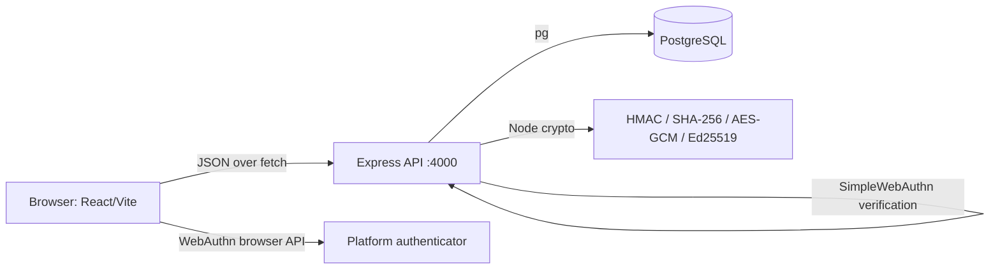
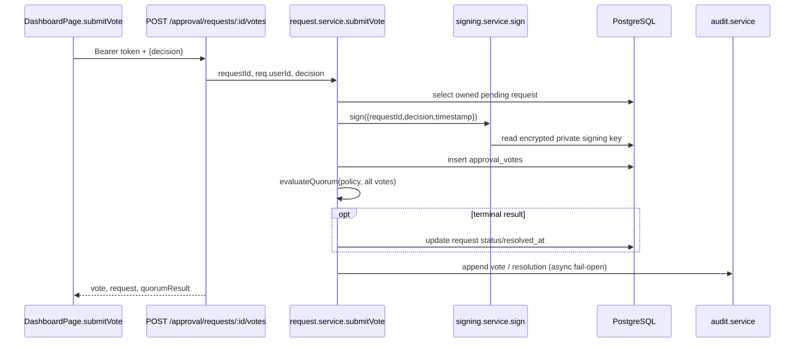

# TrustLine internal architecture handbook

> **Audience:** maintainers and demo engineers. This is code-derived documentation for the repository state at the time it was written. It is not a product claim or a deployment guide. Paths below are relative to the repository root.

## 1. Project structure

```text
trustline/
├── docker-compose.yml                 # PostgreSQL, Redis, API, nginx-served SPA
├── frontend/
│   ├── src/
│   │   ├── main.tsx                    # React root
│   │   ├── App.tsx                     # BrowserRouter and every SPA route
│   │   ├── index.css                   # shared design-system CSS
│   │   ├── lib/                        # API client and sessionStorage token helpers
│   │   ├── pages/                      # route components
│   │   ├── components/                 # reusable/demo-only visual components
│   │   └── assets/                     # bundled raster/vector assets
│   ├── public/                         # static favicon and icon sprite
│   ├── package.json                    # Vite/React/browser dependencies
│   ├── vite.config.ts                  # Vite React plugin
│   ├── tailwind.config.js              # design tokens
│   └── Dockerfile, nginx.conf          # production static container
└── backend/
    ├── src/
    │   ├── index.ts                    # server process and escalation interval
    │   ├── app.ts                      # Express middleware, health route, router mount points
    │   ├── db/pool.ts                  # singleton PostgreSQL `pg.Pool`
    │   ├── lib/                        # environment configuration and Pino logger
    │   ├── middleware/                 # bearer JWT and error middleware
    │   ├── routes/                     # HTTP handlers/controllers
    │   ├── services/                   # business, crypto, session and persistence operations
    │   ├── jobs/                       # periodic escalation check
    │   ├── scripts/                    # seed, smoke, load and audit-chain verification tools
    │   ├── tests/                      # route integration tests
    │   └── types/express.d.ts          # `Request.userId` declaration
    ├── migrations/                     # ordered node-pg-migrate schema migrations
    ├── package.json                    # Express/server dependencies and commands
    └── Dockerfile
```

### Frontend route ownership

| Route                  | Page                              | Responsibility                                                    |
| ---------------------- | --------------------------------- | ----------------------------------------------------------------- |
| `/login`               | `pages/LoginPage.tsx`             | WebAuthn sign-in, optional push-number simulation, TOTP step-up   |
| `/register`            | `pages/RegisterPage.tsx`          | passkey registration and TOTP enrollment QR                       |
| `/dashboard`           | `pages/DashboardPage.tsx`         | sessions, owned pending requests, activity, demo request creation |
| `/demo/dispute`        | `pages/DisputeDemoPage.tsx`       | resolved-request selection and cryptographic receipt display      |
| `/demo/attack`         | `pages/AttackDemoPage.tsx`        | rate-limit/replay demonstrations                                  |
| `/demo/phishing-clone` | `pages/PhishingCloneDemoPage.tsx` | labelled passkey origin-binding demonstration                     |

`components/AdaptiveTrustEngine.tsx`, `AttackSimulation.tsx`, `JudgeMode.tsx`, and `TrustTimeline.tsx` contain explicit mock/demo data and make no backend calls. `components/PushSimulator.tsx` is a local number-matching UI used by `LoginPage`.

## 2. Runtime and data boundaries



Redis is started by `docker-compose.yml`, but no tracked runtime source imports a Redis client or reads `REDIS_URL`. WebAuthn challenge maps and step-up rate-limit state are in-process `Map`s.

`frontend/src/lib/apiClient.ts` is the only fetch wrapper. It uses `VITE_API_URL` or `http://localhost:4000`, JSON bodies, and adds `Authorization: Bearer <access token>` only through `authedGet`, `authedPost`, and `authedDel`.

## 3. Signup and passkey registration

### Execution sequence

```mermaid
sequenceDiagram
  participant U as User
  participant F as RegisterPage.handleSubmit
  participant A as POST /api/auth/register/*
  participant W as webauthn.service
  participant DB as PostgreSQL
  participant P as Platform authenticator
  U->>F: submit email (display name is UI-only)
  F->>A: register/options {email}
  A->>W: generateRegistrationOptionsForUser(email)
  W->>DB: upsert users; select existing credentials
  W-->>A: PublicKeyCredentialCreationOptionsJSON + challenge
  A-->>F: options
  F->>P: startRegistration({optionsJSON})
  P-->>F: RegistrationResponseJSON
  F->>A: register/verify {email,response}
  A->>W: verifyRegistration(email,response)
  W->>DB: insert webauthn_credentials; insert signing_keys
  W-->>A: {userId}
  A-->>F: {verified:true,userId}
  F->>A: totp/setup {userId}
```

| Step                 | Exact implementation                                                                                  | Storage / data passed                                                                                                 | Library                             |
| -------------------- | ----------------------------------------------------------------------------------------------------- | --------------------------------------------------------------------------------------------------------------------- | ----------------------------------- |
| Start                | `RegisterPage.handleSubmit`                                                                           | normalizes `email`; `displayName` is required by the UI but is **not sent**                                           | React                               |
| Options endpoint     | `routes/auth.routes.ts` `POST /register/options`                                                      | `{ email }` → options JSON                                                                                            | Express                             |
| Create/upsert user   | `services/webauthn.service.ts` `generateRegistrationOptionsForUser`                                   | `INSERT INTO users (email, display_name) ... ON CONFLICT`; display name is email local part                           | `pg`                                |
| Create challenge     | same function calls `generateRegistrationOptions` then `challengeStore.set(email, options.challenge)` | process-memory `Map<string,string>`                                                                                   | `@simplewebauthn/server`            |
| Browser ceremony     | `startRegistration` in `RegisterPage`                                                                 | options → `RegistrationResponseJSON`; the private key remains inside the authenticator and is never sent to TrustLine | `@simplewebauthn/browser`, WebAuthn |
| Verify ceremony      | `verifyRegistration` calls `verifyRegistrationResponse`                                               | expected challenge, `config.FRONTEND_ORIGINS`, `RP_ID`                                                                | `@simplewebauthn/server`            |
| Persist credential   | same function                                                                                         | `webauthn_credentials(user_id, credential_id, public_key bytea, counter)`                                             | `pg`                                |
| Per-user signing key | `keys.service.ts` `generateKeypairForUser`                                                            | Ed25519 public PEM plus AES-GCM encrypted private PEM in `signing_keys`                                               | Node `crypto`                       |
| One-time cleanup     | `challengeStore.delete(email)`                                                                        | challenge removed after successful registration only                                                                  | built-in `Map`                      |

The verification endpoint returns `{ verified: true, userId }`; it does **not** issue a JWT or session. TOTP enrollment follows registration.

### WebAuthn details

`services/webauthn.service.ts` is the sole server WebAuthn adapter. `RP_ID` is `process.env.WEBAUTHN_RP_ID ?? 'localhost'`; allowed origins are parsed by `lib/config.ts` into `config.FRONTEND_ORIGINS` (both Vite development ports by default). The server stores only credential ID, public key, and sign counter. `@simplewebauthn/server` is required because it parses and verifies WebAuthn attestation/assertion data; browser-side ceremonies are started with `@simplewebauthn/browser`.

## 4. Login, risk decision, JWT, and session flow

```mermaid
sequenceDiagram
  participant F as LoginPage.handleSignIn
  participant A as auth.routes
  participant W as webauthn.service
  participant R as risk.service
  participant S as session.service
  participant DB as PostgreSQL
  F->>A: POST login/options {email}
  A->>W: generateLoginOptionsForUser
  W->>DB: users + webauthn_credentials lookup
  W-->>F: request options (allowCredentials)
  F->>F: startAuthentication(options)
  F->>A: POST login/verify {email,response}
  A->>W: verifyLogin
  W->>DB: credential lookup, counter update
  A->>R: scoreLoginRisk(userId, req.ip, user-agent)
  alt low
    A->>S: issueSession
    S->>DB: refresh_tokens + login_events + audit log
    A-->>F: accessToken, refreshToken
  else medium/high
    A-->>F: short-lived pendingToken
    F->>A: POST login/step-up {pendingToken, code}
    A->>A: verify JWT + verifyCode
    A->>S: issueSession
  end
  F->>F: setTokens; navigate('/dashboard')
```

| Action          | File/function                                                         | Database work / result                                                                                                            |
| --------------- | --------------------------------------------------------------------- | --------------------------------------------------------------------------------------------------------------------------------- |
| Options         | `LoginPage` then `POST /login/options`; `generateLoginOptionsForUser` | selects user and that user's credential IDs; generated `allowCredentials`; stores `loginChallengeStore[email]`                    |
| Assertion       | `startAuthentication` then `POST /login/verify`; `verifyLogin`        | selects matching user-owned credential, invokes `verifyAuthenticationResponse`, updates its counter, removes successful challenge |
| Risk            | `scoreLoginRisk`                                                      | reads five `login_events` for user; writes a fail-open `risk_decision` audit record                                               |
| Step-up         | `LoginPage.handleTotpSubmit`; `POST /login/step-up`                   | verifies 5-minute `purpose: 'step_up'` JWT, rate-limit Map, then `verifyCode`                                                     |
| Token/session   | `issueSession`                                                        | signs 15-minute access JWT, inserts a SHA-256 hashed random refresh token (7 days), async login/audit records                     |
| Browser storage | `lib/auth.ts` `setTokens`                                             | module variables and `sessionStorage` keys `trustline.accessToken`, `trustline.refreshToken`                                      |

### JWT and protected endpoints

`session.service.ts` uses `jsonwebtoken.sign({ sub: userId }, config.JWT_SECRET, { expiresIn: '15m' })`. Refresh tokens are **not JWTs**: `issueRefreshToken` creates 40 random bytes as hex, stores only `createHash('sha256')` output, and groups rotations by UUID `family_id`. `rotateRefreshToken` revokes a consumed token; presenting a revoked token revokes its entire family.

`middleware/requireAuth.ts` parses `Authorization: Bearer …`, calls `jwt.verify(token, config.JWT_SECRET)`, requires `payload.sub`, then assigns `req.userId`. All approval, ledger, sessions, and audit routes use it. `DELETE /api/auth/sessions/:familyId` scopes the `UPDATE` by both family and `req.userId`.

## 5. TOTP enrollment and verification

`RegisterPage.handleSubmit` calls `POST /api/auth/totp/setup` after passkey verification. `generateSecretForUser(userId)` reads `users.email`, creates a random 20-byte secret, Base32-encodes it, updates `users.totp_secret` and `totp_enabled=false`, then returns `{ secret, otpauthUrl }`. `RegisterPage` passes only `otpauthUrl` to `QRCode.toDataURL` from the `qrcode` package and displays the resulting data URL. `handleTotpVerify` posts `{userId, code}` to `/api/auth/totp/verify`.

| Helper in `services/totp.service.ts`    | Actual job                                                                                                                                                             |
| --------------------------------------- | ---------------------------------------------------------------------------------------------------------------------------------------------------------------------- |
| `decodeBase32`                          | normalizes case/whitespace/hyphens, validates RFC 4648 characters and padding, converts five-bit symbols to `Buffer` bytes                                             |
| `encodeBase32` / `generateBase32Secret` | internal unpadded RFC 4648 encoder and 160-bit `randomBytes(20)` secret generator                                                                                      |
| `counterBuffer`                         | serializes non-negative HOTP counter as eight-byte big-endian buffer                                                                                                   |
| `generateHOTP`                          | `createHmac('sha1', secret).update(counter)`, RFC 4226 dynamic truncation, `mod 10 ** digits`, leading-zero padding                                                    |
| `generateTOTP`                          | computes `floor(timestampMs / 30_000)` and calls HOTP for six digits                                                                                                   |
| `verifyTOTP`                            | validates six decimal digits; calculates candidates for `-window … +window` (default ±1); compares each candidate using `timingSafeEqual` without an early loop return |
| `buildOtpAuthUri`                       | produces `otpauth://totp/TrustLine:<email>?secret=…&issuer=TrustLine&algorithm=SHA1&digits=6&period=30`                                                                |
| `verifyCode`                            | reads `totp_secret`, calls `verifyTOTP`, then sets `totp_enabled=true`                                                                                                 |

No OTP verification package is in `backend/package.json`; the cryptographic primitives are Node built-ins. HMAC-SHA1 is the RFC 4226/6238 interoperable default, not a general-purpose hashing choice. Tests in `services/totp.service.test.ts` cover RFC 4226 and RFC 6238 vectors.

## 6. Approval, signing, ledger, and dispute flow



Important implementation fact: `submitVote` selects the request with `WHERE id = $1 AND requester_id = $2`, with the authenticated user supplied as `approverId`. Therefore the current demo permits the request owner to vote on their own request; there is no server-side role/reviewer-assignment model despite policy `eligible_roles` fields. `GET /requests/pending` also returns only requests where `requester_id = req.userId`.

| Concern        | File/function                                                    | Data and behavior                                                                                              |
| -------------- | ---------------------------------------------------------------- | -------------------------------------------------------------------------------------------------------------- |
| Policy CRUD    | `policy.service.ts`: `createPolicy`, `listPolicies`, `getPolicy` | `approval_policies`; create/list/read routes require JWT but are not owner-scoped                              |
| Request        | `request.service.ts` `createRequest`                             | reads policy version, inserts pending `approval_requests` with version snapshot                                |
| Vote           | `submitVote`                                                     | validates pending ownership, checks delegation state, signs, inserts one vote per approver (unique constraint) |
| Quorum         | `quorum.service.ts` `evaluateQuorum`                             | pure function for `n_of_m`, `single_senior`, and count-based `role_weighted`                                   |
| Resolve        | `submitVote`                                                     | updates `status` to `approved`/`denied`, sets `resolved_at` when quorum terminal                               |
| Break-glass    | `breakGlass`                                                     | owner-scoped force approval with `break_glass=true`, `needs_review=true`; it does not append an audit entry    |
| Escalation     | `jobs/escalation.job.ts` `runEscalationCheck`                    | every 30 seconds after `index.ts` starts; marks overdue pending requests `escalated=true`                      |
| Dispute picker | `listResolvedRequests`                                           | requester-scoped approved/denied/expired list used by `DisputeDemoPage`                                        |
| Receipt        | `audit.service.ts` `getReceiptForRequest`                        | requester-scoped request existence, then its votes/public keys and audit entries with `payload @> {requestId}` |

### Digital signatures

During successful passkey registration, `generateKeypairForUser` invokes Node `generateKeyPairSync('ed25519')`. `encryptPrivateKey` derives a 32-byte key via SHA-256 of `SIGNING_KEY_ENCRYPTION_SECRET`, creates a 96-bit IV with `randomBytes(12)`, and stores AES-256-GCM `iv:tag:ciphertext` hex in `signing_keys.encrypted_private_key`; `public_key` is PEM.

`signing.service.ts` `sign` decrypts the private key (and can re-encrypt it using an active secret), canonicalizes the shallow payload with alphabetically sorted keys, then calls `crypto.sign(null, data, privateKeyPem)` and returns Base64. `verify`, and its DB wrapper `verifyForUser`, call `crypto.verify(null, data, publicKeyPem, signature)`. The route always signs server-side; it does not perform a WebAuthn ceremony for an approval vote.

### Audit chain

`audit.service.ts` `appendAuditEntry` opens a transaction, locks the latest audit row with `FOR UPDATE`, uses `GENESIS` for the first predecessor, and computes `SHA-256(prevHash + JSON.stringify(payload))`. It inserts `entry_type`, JSONB payload, prior hash (null for genesis), and current hash. It is append-only by application convention, not a database immutability constraint. `scripts/verifyChain.ts` fetches the whole table in ID order and recomputes/validates linkage with the exported `computeHash`.

`issueSession` asynchronously logs `login`; `scoreLoginRisk` logs `risk_decision`; `submitVote` asynchronously logs `vote` and terminal `request_resolved`. These writes are fail-open: their promise errors are logged and do not fail the calling operation.

## 7. Database catalog

| Table                  | Columns (key fields)                                                                               | Written/read by                                                         |
| ---------------------- | -------------------------------------------------------------------------------------------------- | ----------------------------------------------------------------------- |
| `users`                | `id`, `email`, `display_name`, `created_at`, `totp_secret`, `totp_enabled`                         | WebAuthn upsert/read; TOTP read/update; seed                            |
| `webauthn_credentials` | `id`, `user_id → users`, `credential_id` unique, `public_key bytea`, `counter`, `created_at`       | WebAuthn registration insert; login options/read; login counter update  |
| `refresh_tokens`       | `id`, `user_id → users`, `token_hash` unique, `family_id`, `revoked`, timestamps                   | session issue/rotate; sessions list/revoke                              |
| `approval_policies`    | `id`, name, quorum fields, JSONB roles/escalation/geofence, version                                | policy service, request creation, escalation, seed                      |
| `approval_requests`    | IDs, policy snapshot, requester, JSONB action, status/timestamps, escalation and break-glass flags | request service; dashboard pending query; receipt/dispute authorization |
| `approval_votes`       | request/user FKs, decision, Base64 signature, timestamp; unique `(request_id,approver_id)`         | `submitVote`; receipt query                                             |
| `audit_log`            | bigserial ID, type, JSONB payload, previous/current SHA-256 hashes, timestamp                      | audit service; dashboard activity; verifier script                      |
| `delegations`          | delegator/delegate FKs, expiry, timestamp                                                          | delegation service; vote eligibility lookup                             |
| `signing_keys`         | one row/user, public PEM, AES-GCM encrypted private PEM                                            | key service/signing service/receipt join                                |
| `login_events`         | ID, user FK, IP, user-agent, timestamp                                                             | `issueSession` insert; risk and sessions reads                          |

Schema authority is the numbered `backend/migrations/00001_…00011_*.js` files. Relationships are defined there using UUID foreign keys and specified `CASCADE`/`RESTRICT` behavior.

## 8. API map

All routes are mounted by `backend/src/app.ts`; controllers are inline handlers in the listed router files.

<details><summary><strong>Authentication and sessions</strong></summary>

| Method | Route                          | Handler/service                                                        | Auth                   | Frontend caller                           |
| ------ | ------------------------------ | ---------------------------------------------------------------------- | ---------------------- | ----------------------------------------- |
| POST   | `/api/auth/register/options`   | auth router → `generateRegistrationOptionsForUser`                     | no                     | `RegisterPage.handleSubmit`               |
| POST   | `/api/auth/register/verify`    | auth router → `verifyRegistration`                                     | no                     | `RegisterPage.handleSubmit`               |
| POST   | `/api/auth/login/options`      | auth router → `generateLoginOptionsForUser`                            | no                     | `LoginPage.handleSignIn`, phishing demo   |
| POST   | `/api/auth/login/verify`       | auth router → `verifyLogin`, `scoreLoginRisk`, optional `issueSession` | no                     | `LoginPage.handleSignIn`                  |
| POST   | `/api/auth/login/step-up`      | auth router → `recordStepUpAttempt`, `verifyCode`, `issueSession`      | pending JWT in body    | `LoginPage.handleTotpSubmit`, attack demo |
| POST   | `/api/auth/totp/setup`         | auth router → `generateSecretForUser`                                  | no                     | `RegisterPage.handleSubmit`               |
| POST   | `/api/auth/totp/verify`        | auth router → `verifyCode`                                             | no                     | `RegisterPage.handleTotpVerify`           |
| POST   | `/api/auth/refresh`            | auth router → `rotateRefreshToken`                                     | no, refresh token body | attack demo                               |
| GET    | `/api/auth/sessions`           | auth router SQL query                                                  | bearer                 | dashboard `loadSessions`                  |
| DELETE | `/api/auth/sessions/:familyId` | auth router SQL update                                                 | bearer                 | dashboard `revokeSession`                 |
| GET    | `/api/auth/audit`              | auth router SQL query                                                  | bearer                 | dashboard `loadActivity`                  |

</details>

<details><summary><strong>Approvals, ledger, health, risk</strong></summary>

| Method | Route                                    | Handler/service                | Auth   | Frontend caller            |
| ------ | ---------------------------------------- | ------------------------------ | ------ | -------------------------- |
| POST   | `/api/approval/policies`                 | `createPolicy`                 | bearer | dashboard demo creation    |
| GET    | `/api/approval/policies`                 | `listPolicies`                 | bearer | dashboard demo creation    |
| GET    | `/api/approval/policies/:id`             | `getPolicy`                    | bearer | no tracked frontend caller |
| POST   | `/api/approval/requests`                 | `createRequest`                | bearer | dashboard demo creation    |
| POST   | `/api/approval/requests/:id/votes`       | `submitVote`                   | bearer | dashboard `submitVote`     |
| POST   | `/api/approval/delegations`              | `createDelegation`             | bearer | no tracked frontend caller |
| POST   | `/api/approval/requests/:id/break-glass` | `breakGlass`                   | bearer | no tracked frontend caller |
| GET    | `/api/approval/requests`                 | `listResolvedRequests`         | bearer | dispute page               |
| GET    | `/api/approval/requests/pending`         | inline requester-scoped query  | bearer | dashboard                  |
| GET    | `/api/ledger/receipt/:requestId`         | `getReceiptForRequest`         | bearer | dispute page               |
| GET    | `/health`                                | inline `SELECT 1` health check | no     | Docker health check        |

</details>

## 9. Dashboard widget map

| Widget            | Frontend                     | Endpoint                               | Backend query/service                                                                  |
| ----------------- | ---------------------------- | -------------------------------------- | -------------------------------------------------------------------------------------- |
| Active Sessions   | `DashboardPage.loadSessions` | `GET /api/auth/sessions`               | active `refresh_tokens` for JWT subject, lateral most-recent `login_events`            |
| Pending Approvals | `loadApprovals`              | `GET /api/approval/requests/pending`   | requester-scoped pending `approval_requests`, max 50                                   |
| Recent Activity   | `loadActivity`               | `GET /api/auth/audit`                  | `audit_log` JSONB payload containing `userId` or `approverId`, max 50                  |
| Demo Request      | `createDemoRequest`          | policy list/create then request create | creates/finds `TrustLine Demo Policy`, `single_senior`, then a `demo_transfer` payload |

## 10. Demo/simulated data inventory

| Location                          | Exact simulated material                                                                                    | Calls backend?                                         |
| --------------------------------- | ----------------------------------------------------------------------------------------------------------- | ------------------------------------------------------ |
| `DashboardPage.createDemoRequest` | policy `TrustLine Demo Policy`; `demo_transfer`, USD `1000.00`, current timestamp                           | yes                                                    |
| `scripts/seed.ts`                 | Alice/Bob/Carol demo users; `Demo 2-of-3 Quorum`, roles `senior`/`manager`, one-hour escalation             | DB seed only                                           |
| `AttackDemoPage`                  | fake unsigned-looking `DEMO_FAKE_SIGNATURE` pending token for `demo-attacker-001`; invalid code `000000`    | yes, intentionally exercises step-up/refresh endpoints |
| `PhishingCloneDemoPage`           | fake shown domain `secure-trustline-login.example.com`, misspelled wordmark; calls options but never verify | options call only                                      |
| `AdaptiveTrustEngine.tsx`         | `MOCK_TRUST_DATA` scenarios                                                                                 | no                                                     |
| `AttackSimulation.tsx`            | `MOCK_SCENARIOS` browser-only attack scenarios                                                              | no                                                     |
| `TrustTimeline.tsx`               | `MOCK_EVENTS`                                                                                               | no                                                     |
| `JudgeMode.tsx`                   | `DEMO_STEPS`; orchestrates mock components                                                                  | no                                                     |

No hard-coded approval request UUIDs exist in tracked application source. Test fixtures/mocks are confined to `backend/src/tests` and service unit tests.

## 11. Library inventory

| Library/module            | Why used                                                  | Primary files                             | Remove/alternative                                      |
| ------------------------- | --------------------------------------------------------- | ----------------------------------------- | ------------------------------------------------------- |
| React / React DOM         | SPA state/rendering                                       | all frontend pages/components, `main.tsx` | foundational                                            |
| React Router DOM          | SPA routes                                                | `App.tsx`, page navigation                | native history would require a rewrite                  |
| `@simplewebauthn/browser` | browser WebAuthn JSON ceremonies                          | Login/Register/Phishing pages             | direct WebAuthn API could replace it                    |
| `@simplewebauthn/server`  | server attestation/assertion validation                   | `webauthn.service.ts`                     | direct protocol validation is impractical/risky         |
| `qrcode`                  | renders returned `otpauth://` URI to data URL             | `RegisterPage.tsx`                        | any QR renderer; not involved in TOTP verification      |
| Express / cors            | HTTP routing/body/CORS                                    | `app.ts`, route files                     | foundational API choice                                 |
| `pg`                      | PostgreSQL pool/query client                              | pool and services/routes                  | PostgreSQL driver required                              |
| `jsonwebtoken`            | access/pending JWT signing and verification               | auth routes, session service, middleware  | Node crypto implementation would be a major replacement |
| Pino / pino-http          | structured logs/request logging                           | logger, app, services                     | replaceable logger                                      |
| dotenv                    | environment loading                                       | `lib/config.ts`                           | platform env injection                                  |
| node-pg-migrate           | schema migrations                                         | migrations/scripts                        | migration framework                                     |
| Node `crypto`             | native TOTP, hashing, AES-GCM, Ed25519, secure randomness | TOTP/audit/keys/signing/session services  | built-in; no third-party TOTP library                   |

## 12. File dependency map and demo checklist

| Important file                  | Called by                   | Calls/imports                                       | Purpose                           |
| ------------------------------- | --------------------------- | --------------------------------------------------- | --------------------------------- |
| `backend/src/index.ts`          | Node start command          | config, app, escalation job                         | starts server and 30-second job   |
| `app.ts`                        | index/tests                 | cors, routers, pool, error handler                  | HTTP composition                  |
| `routes/auth.routes.ts`         | app                         | WebAuthn, TOTP, risk, session services              | auth/session controller           |
| `services/webauthn.service.ts`  | auth router                 | SimpleWebAuthn, pool, keys                          | passkey options and verification  |
| `services/totp.service.ts`      | auth router                 | Node crypto, pool                                   | RFC TOTP enrollment/verification  |
| `services/session.service.ts`   | auth router                 | crypto, JWT, pool, audit                            | token family lifecycle            |
| `routes/approval.routes.ts`     | app                         | auth middleware, policy/request/delegation services | approval controller               |
| `services/request.service.ts`   | approval router             | pool, quorum, delegation, signing, audit            | request/vote/resolution           |
| `services/audit.service.ts`     | session/risk/request/ledger | crypto, pool                                        | append chain and receipt assembly |
| `frontend/src/lib/apiClient.ts` | pages                       | browser fetch                                       | API URL/errors/auth headers       |
| `frontend/src/lib/auth.ts`      | Login/Dashboard/Attack      | sessionStorage                                      | current-tab tokens                |

### Before a demo

- [ ] `backend/.env` supplies `DATABASE_URL` and `JWT_SECRET`; `WEBAUTHN_RP_ID` matches the host. `JWT_REFRESH_SECRET` and `REDIS_URL` are not read by the current backend.
- [ ] Backend CORS `FRONTEND_ORIGIN` includes the actual browser origin; WebAuthn expected origins come from the same parsed list.
- [ ] Migrations have been applied; optional seed data is clearly identified as demo data.
- [ ] Use a WebAuthn-capable browser/platform authenticator.
- [ ] Explain that a passkey private key stays in the authenticator; TrustLine stores public credential material.
- [ ] Explain that TOTP verification is native Node `crypto` (`verifyTOTP` → `verifyCode`), while `qrcode` only renders enrollment data.
- [ ] Explain that the dashboard request workflow is owner-scoped demo behavior, not a full reviewer/role authorization system.
- [ ] Explain mock-only components and attack simulations before presenting them as live security controls.
- [ ] Run `npm run verify-chain` from `backend/` to independently validate existing audit hashes.

## 13. Fast answers for mentors

| Question                                    | Code-derived answer                                                                                                   |
| ------------------------------------------- | --------------------------------------------------------------------------------------------------------------------- |
| Who verifies TOTP?                          | `services/totp.service.ts` `verifyTOTP`, called by `verifyCode`; Node `crypto.timingSafeEqual` compares values.       |
| Where is QR data generated?                 | Server creates the URI in `buildOtpAuthUri`; `RegisterPage` renders it using `QRCode.toDataURL`.                      |
| Where is the secret stored?                 | `users.totp_secret`, set by `generateSecretForUser`; it is currently a text column.                                   |
| Who verifies passkeys?                      | `@simplewebauthn/server` in `verifyRegistration` and `verifyLogin`.                                                   |
| Where are challenges stored?                | `challengeStore` and `loginChallengeStore`, process-memory Maps in `webauthn.service.ts`.                             |
| Where is JWT made?                          | `session.service.ts` `issueSession` / `rotateRefreshToken`; pending step-up JWT is signed inline in `auth.routes.ts`. |
| Where are signing keys stored?              | `signing_keys`; public PEM plain, private PEM AES-256-GCM encrypted.                                                  |
| How is the audit chain checked?             | `scripts/verifyChain.ts` reuses `audit.service.ts` `computeHash`.                                                     |
| Does approval use a browser passkey prompt? | No. `submitVote` uses the server-held Ed25519 signing key through `signing.service.ts`.                               |
