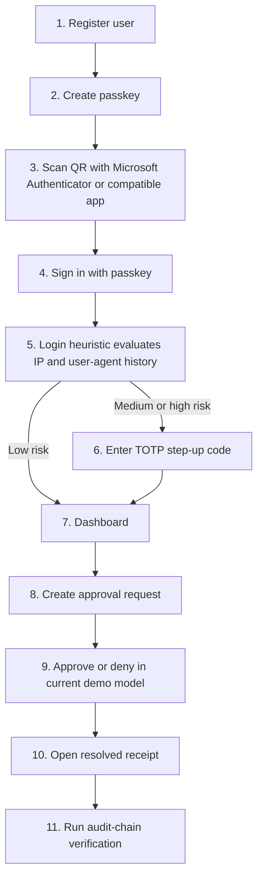
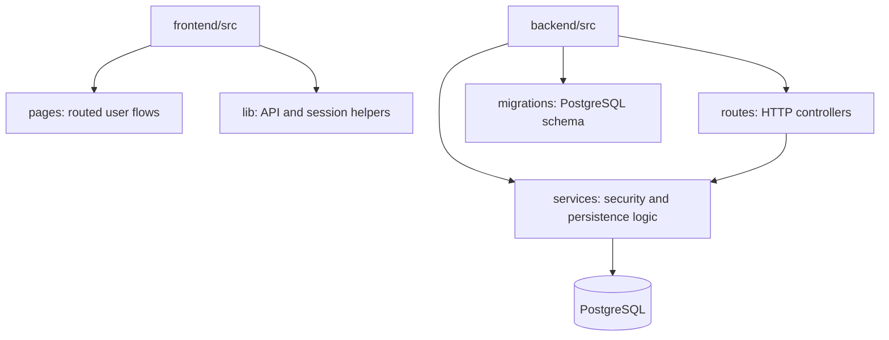
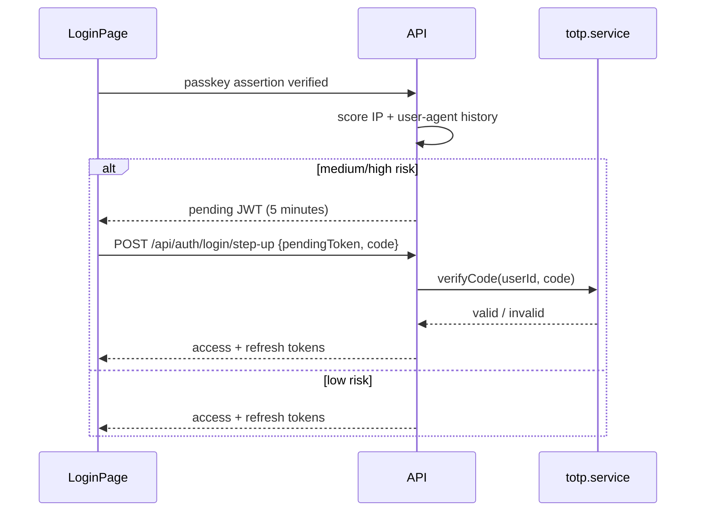
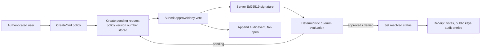

# TrustLine

> **Passwordless identity, adaptive step-up, and tamper-evident approval evidence—implemented as an inspectable security engineering demonstration.**

[](https://www.typescriptlang.org/)
[](https://nodejs.org/)
[](https://react.dev/)
[](https://expressjs.com/)
[](https://www.w3.org/TR/webauthn-3/)
[](https://www.postgresql.org/)
[](https://docs.docker.com/compose/)
[](#license)

TrustLine is a full-stack TypeScript project for demonstrating how phishing-resistant sign-in, risk-triggered TOTP, approval decisions, and cryptographic receipts can fit into one workflow. It is built for a hackathon and portfolio review: the code favors explicit flows, inspectable primitives, and honest boundaries over unimplemented enterprise claims.

## Why TrustLine?

For a non-technical reader, TrustLine asks a practical question: **how can an organization be confident that the right person signed in, that a sensitive action was intentionally approved, and that the resulting record can be checked later?**

For an engineering reader, it combines three related problems that are often treated separately:

- **Authentication:** passwords are reusable secrets that can be guessed, reused after a breach, or entered into a phishing page. TrustLine uses passkeys, where the authenticator keeps the private key and the service verifies a public-key response bound to the legitimate origin.
- **Authorization and approval integrity:** a compromised or overly powerful account can still create risky actions. TrustLine models requests, votes, quorum evaluation, signatures, and receipts to make the approval path inspectable.
- **Auditability:** a database row saying “approved” is weak evidence by itself. TrustLine links audit entries with SHA-256 hashes and exposes the related vote/public-key material in a receipt view.

The result is not a claim to solve every enterprise IAM problem. It is a focused demonstration of why identity assurance, decision integrity, and evidence need to be designed together.

## Highlights

- ✅ Passwordless WebAuthn passkey registration and sign-in
- ✅ Adaptive TOTP step-up with a native RFC 6238 implementation
- ✅ Opaque refresh-token families with reuse detection
- ✅ Policy/request/vote/quorum workflow demonstration
- ✅ Ed25519 receipt signatures and AES-256-GCM private-key protection
- ✅ SHA-256 tamper-evident audit chain and verifier script
- ✅ Fully TypeScript frontend and backend with Docker Compose local stack
- ✅ Clearly labelled phishing, MFA-fatigue, replay, and mock-security demonstrations

## Documentation hub

| Document                                                 | Read this when you need…                                        |
| -------------------------------------------------------- | --------------------------------------------------------------- |
| [README.md](README.md)                                   | a concise product, setup, and implementation overview           |
| [AUTH_FLOW.md](AUTH_FLOW.md)                             | the exact signup, passkey, TOTP, and session sequence           |
| [PROJECT_ARCHITECTURE.md](PROJECT_ARCHITECTURE.md)       | file/function/data-store ownership across the codebase          |
| [REVIEW_QUESTIONS.md](REVIEW_QUESTIONS.md)               | mentor-style challenge questions and mock viva preparation      |
| [PRODUCTION_GAP_ANALYSIS.md](PRODUCTION_GAP_ANALYSIS.md) | code-derived production limits and prioritized remediation work |
| [docs/demo-script.md](docs/demo-script.md)               | a judge-facing walkthrough; validate claims against this README |

> [!IMPORTANT]
> TrustLine is a security demonstration, **not** a production IAM or approval product. The current approval model is requester-scoped; it does not yet contain independent reviewer assignment, role enforcement, recovery codes, distributed challenge storage, or externally anchored audit evidence. See [PRODUCTION_GAP_ANALYSIS.md](PRODUCTION_GAP_ANALYSIS.md) for the code-derived production gaps.

## Contents

- [Why TrustLine?](#why-trustline)
- [Highlights](#highlights)
- [Documentation hub](#documentation-hub)
- [Key features and status](#key-features-and-status)
- [Architecture](#architecture)
- [Live demo flow](#live-demo-flow)
- [Threat model](#threat-model)
- [Engineering decisions](#engineering-decisions)
- [Quick start](#quick-start)
- [Repository walkthrough](#repository-walkthrough)
- [Authentication](#authentication)
- [Step-up authentication](#step-up-authentication)
- [JWT and session management](#jwt-and-session-management)
- [Authorization and approvals](#authorization-and-approvals)
- [Cryptography and ledger](#cryptography-and-ledger)
- [Database](#database)
- [API overview](#api-overview)
- [Security boundaries](#security-boundaries)
- [Testing and deployment](#testing-and-deployment)
- [Limitations, roadmap, and team](#limitations-roadmap-and-team)

## Key features and status

| Area                    | What is implemented                                                                                                 | Why it exists                                                         | Status                               |
| ----------------------- | ------------------------------------------------------------------------------------------------------------------- | --------------------------------------------------------------------- | ------------------------------------ |
| Passwordless sign-in    | WebAuthn registration/authentication with SimpleWebAuthn, credential public keys, counters, RP ID and origin checks | avoids password storage and makes origin-bound phishing harder        | Implemented                          |
| Adaptive step-up        | IP/user-agent login-history heuristic; RFC 6238 TOTP when score is medium/high                                      | shows that sensitive login contexts can require another factor        | Implemented heuristic                |
| TOTP enrollment         | RFC 4648 Base32 secret, standard `otpauth://` URI, QR rendering, Node `crypto` verification                         | interoperates with standard authenticator apps                        | Implemented                          |
| Sessions                | 15-minute bearer access JWTs; 7-day opaque refresh tokens hashed in PostgreSQL and rotated by family                | limits access-token lifetime and detects consumed-token reuse         | Implemented                          |
| Approval workflow       | policies, requests, quorum evaluator, vote records, delegations, escalation flag, break-glass route                 | demonstrates approval-state modelling                                 | Implemented demo model               |
| Signatures and receipts | server-side Ed25519 vote signatures, encrypted private keys, receipt endpoint                                       | makes approval evidence inspectable                                   | Implemented, server-held keys        |
| Audit ledger            | SHA-256 linked audit entries and independent verifier script                                                        | demonstrates tamper-evident sequencing                                | Implemented, not externally anchored |
| Demonstrations          | MFA-fatigue/replay page; phishing-clone page; mock trust/attack/Judge Mode components                               | explains attack properties without presenting simulations as controls | Mixed API-backed and mock—labelled   |

## Architecture

```mermaid
flowchart LR
  U[User] --> F[React SPA]
  F -->|JSON / Bearer token| A[Express API]
  F -->|WebAuthn ceremony| W[Platform authenticator]
  A --> P[(PostgreSQL)]
  A --> C[Node crypto\nTOTP · Ed25519 · AES-GCM · SHA-256]
  A --> S[@simplewebauthn/server]
```

| Layer        | Technology                    | Why this choice                                                             | Role in TrustLine                                    |
| ------------ | ----------------------------- | --------------------------------------------------------------------------- | ---------------------------------------------------- |
| UI           | React, Vite, TypeScript       | component model and fast typed development                                  | browser ceremonies, dashboard, demonstrations        |
| API          | Express, TypeScript           | small explicit HTTP surface                                                 | routes, middleware, orchestration                    |
| Database     | PostgreSQL via `pg`           | relational constraints plus JSONB for action/policy payloads                | identities, credentials, sessions, approvals, ledger |
| WebAuthn     | SimpleWebAuthn browser/server | maintained protocol implementation rather than handwritten WebAuthn parsing | passkey option generation and verification           |
| Cryptography | Node.js `crypto`              | built-in CSPRNG, HMAC, AES-GCM, Ed25519, SHA-256                            | TOTP, token hashing, key protection, signing, ledger |
| Operations   | Docker Compose, Pino          | reproducible local stack and structured logs                                | local infrastructure and diagnostics                 |

> [!NOTE]
> Docker Compose starts Redis for the local stack, but the current tracked application does not import a Redis client. WebAuthn challenges and the step-up limiter are in-process state; this is one reason the repository is not horizontally production-ready.

### Why these technologies?

| Technology     | Selected for TrustLine                                         | Instead of                                    | Trade-off                                                           |
| -------------- | -------------------------------------------------------------- | --------------------------------------------- | ------------------------------------------------------------------- |
| React + Vite   | typed component UI and fast local iteration                    | server-rendered UI / larger meta-framework    | client handles browser/session state                                |
| Express        | explicit, compact route and middleware composition             | NestJS / Fastify                              | fewer built-in architectural conventions                            |
| TypeScript     | shared type discipline across browser and server               | untyped JavaScript                            | runtime validation is still separately required                     |
| PostgreSQL     | transactions, foreign keys, indexes, JSONB                     | MongoDB                                       | schema/migration ownership requires care                            |
| SimpleWebAuthn | maintained WebAuthn ceremony verification                      | hand-written protocol parsing                 | external library dependency, but avoids unsafe custom protocol work |
| Node `crypto`  | standard library primitives and native RFC 6238 implementation | OTP/crypto utility packages                   | application must maintain well-tested protocol glue                 |
| Docker Compose | reproducible local multi-service environment                   | manual service setup                          | not a production orchestration platform                             |
| Pino           | structured Node logging                                        | console logging / heavier observability stack | metrics/tracing still need separate production tooling              |
| Vitest         | fast TypeScript-oriented unit/route testing                    | Jest / Mocha                                  | critical integrations still need real DB/browser coverage           |

## Live demo flow



The QR flow uses a standard `otpauth://` URI, so Microsoft Authenticator and other RFC 6238-compatible apps can enroll it. The “Approve or deny” step is intentionally requester-scoped in the current demo; it is not a separate human-reviewer workflow.

## Threat model

| Threat                    | Attack                                 | Current mitigation                            | TrustLine feature / honest boundary                                         |
| ------------------------- | -------------------------------------- | --------------------------------------------- | --------------------------------------------------------------------------- |
| Credential stuffing       | reused password attempted at login     | no password login path                        | WebAuthn passkeys; no password database                                     |
| Password database breach  | hash database copied and cracked       | passwords are not stored                      | passkey public credentials only                                             |
| Password reuse            | a secret from another site is replayed | no shared password secret                     | passkeys are origin-bound credentials                                       |
| Phishing                  | lookalike page asks for a credential   | RP/origin verification in WebAuthn            | passkey ceremony; phishing page is an educational demo                      |
| WebAuthn assertion replay | captured assertion is resubmitted      | challenge and credential counter verification | implemented; challenge store is currently in-memory                         |
| Refresh-token replay      | consumed renewal token is reused       | family revocation                             | opaque hashed token rotation; concurrent-race hardening remains future work |
| Session hijacking         | bearer token is stolen in browser      | short access-token TTL and family revocation  | sessionStorage remains an identified XSS risk                               |
| Tampered approval         | vote/decision data is altered          | signature/receipt material and audit records  | signatures are server-held, not user-held approval assertions               |
| Audit modification        | audit row/hash is changed              | linked SHA-256 hashes and verifier script     | tamper-evident, not externally immutable/anchored                           |
| Insider manipulation      | creator attempts to approve own action | requester scoping prevents cross-user leakage | independent reviewer/role controls are not yet implemented                  |

## Engineering decisions

| Decision                                | What and why                                                               | Alternative                      | Trade-off                                                      |
| --------------------------------------- | -------------------------------------------------------------------------- | -------------------------------- | -------------------------------------------------------------- |
| Passkeys over passwords                 | primary public-key, origin-aware sign-in; avoids reusable password storage | passwords + MFA                  | requires supported authenticators and a recovery design        |
| TOTP over SMS OTP                       | standards-compatible secondary factor with no telecom dependency           | SMS/email OTP                    | shared-secret factor; current secrets need at-rest encryption  |
| Ed25519 over RSA                        | compact modern signatures with Node support                                | RSA-PSS / ECDSA                  | current signer is server-held, limiting non-repudiation claims |
| AES-GCM over CBC                        | encryption plus integrity/authentication tag                               | AES-CBC + separate MAC           | key custody/rotation remains a production concern              |
| Opaque refresh values over refresh JWTs | server-side lookup/revocation and no embedded trusted claims               | signed refresh JWT               | database lookup/rotation coordination is required              |
| PostgreSQL over MongoDB                 | relational integrity, transactions, and indexed security records           | document store                   | JSONB flexibility still requires validation                    |
| Node `crypto` for TOTP                  | native HMAC/CSPRNG/timing-safe comparison; RFC vectors are tested          | OTP package                      | protocol implementation must remain carefully reviewed         |
| SimpleWebAuthn over manual WebAuthn     | maintained ceremony parser/verifier                                        | custom CBOR/attestation handling | dependency lifecycle must be maintained                        |

## Screenshots

Screenshots are intentionally not committed in the current repository. Add them under `docs/screenshots/` when available:

| Screen                                   | Suggested asset                                                          |
| ---------------------------------------- | ------------------------------------------------------------------------ |
| Passkey registration and TOTP enrollment | `docs/screenshots/register.png`                                          |
| Passwordless sign-in and step-up         | `docs/screenshots/login.png`                                             |
| Dashboard and owned pending requests     | `docs/screenshots/dashboard.png`                                         |
| Resolved request receipt                 | `docs/screenshots/dispute.png`                                           |
| Attack and phishing demonstrations       | `docs/screenshots/attack-demo.png`, `docs/screenshots/phishing-demo.png` |

<!-- Screenshot placeholders: add the files above when assets are available. -->


## Quick start

### Prerequisites

- Node.js 20+
- Docker Desktop / Docker Compose (recommended for PostgreSQL)
- A WebAuthn-capable browser and platform authenticator

### Run with Docker

```bash
git clone https://github.com/Kushh-Santhosh/TRUSTLINE.git
cd TRUSTLINE
cp backend/.env.example backend/.env
# Set a strong JWT_SECRET and, for production-like local testing, a separate SIGNING_KEY_ENCRYPTION_SECRET.
docker compose up --build
docker compose exec backend npm run migrate:up
```

The frontend is served on `http://localhost:5173`; the API is on `http://localhost:4000`; health is `http://localhost:4000/health`.

### Run services locally

```bash
# Start PostgreSQL (for example with Docker Compose)
docker compose up -d postgres

cd backend
cp .env.example .env
npm install
npm run migrate:up
npm run dev

# In another terminal
cd frontend
cp .env.example .env
npm install
npm run dev
```

`frontend/.env` may set `VITE_API_URL=http://localhost:4000`. For local WebAuthn, `WEBAUTHN_RP_ID=localhost` and `FRONTEND_ORIGIN=http://localhost:5173,http://localhost:5174` support the common Vite ports.

### Required backend environment

| Variable                        | Purpose                                                                                            |
| ------------------------------- | -------------------------------------------------------------------------------------------------- |
| `DATABASE_URL`                  | PostgreSQL connection string                                                                       |
| `JWT_SECRET`                    | signs/verifies access and pending step-up JWTs                                                     |
| `SIGNING_KEY_ENCRYPTION_SECRET` | optional in development; encrypts stored Ed25519 private keys and should be separate in production |
| `FRONTEND_ORIGIN`               | comma-separated allowed browser origins for CORS and WebAuthn verification                         |
| `WEBAUTHN_RP_ID`                | relying-party ID, normally the frontend host                                                       |
| `PORT`                          | API port; defaults to `4000`                                                                       |

`JWT_REFRESH_SECRET` is **not used by the current backend**. Refresh tokens are random opaque values, not JWTs. `REDIS_URL` is also not read by the current runtime source.

## Repository walkthrough



| Directory/file             | Why it exists                         | How it interacts                                                                     |
| -------------------------- | ------------------------------------- | ------------------------------------------------------------------------------------ |
| `frontend/src/pages/`      | route-level UI flows                  | calls `lib/apiClient.ts`; WebAuthn pages use SimpleWebAuthn browser                  |
| `frontend/src/components/` | reusable UI plus labelled simulations | `PushSimulator` is used by login; several components are mock-only                   |
| `frontend/src/lib/`        | request and token helpers             | `apiClient.ts` sends JSON/Bearer requests; `auth.ts` stores tokens in sessionStorage |
| `backend/src/routes/`      | API controllers                       | validates basic inputs and calls services                                            |
| `backend/src/services/`    | security/persistence behavior         | WebAuthn, TOTP, sessions, risk, approvals, keys, signing, audit                      |
| `backend/src/middleware/`  | cross-cutting HTTP concerns           | `requireAuth` validates access JWTs and sets `req.userId`                            |
| `backend/migrations/`      | schema source of truth                | creates tables, relationships, unique constraints, indexes                           |
| `backend/src/scripts/`     | operational/demo tools                | seed data, smoke/load requests, independent audit-chain verifier                     |

### Service map

| Service                                    | Problem solved                                            | Depended on by                           | If removed                           |
| ------------------------------------------ | --------------------------------------------------------- | ---------------------------------------- | ------------------------------------ |
| `webauthn.service.ts`                      | passkey options, challenge verification, counter updates  | auth routes                              | passkey ceremonies cannot run        |
| `totp.service.ts`                          | standard QR provisioning and native RFC 6238 verification | auth routes                              | step-up/enrollment cannot run        |
| `session.service.ts`                       | access JWT issuance and refresh-family rotation           | auth routes                              | no authenticated browser session     |
| `risk.service.ts`                          | simple risk outcome and step-up attempt limit             | auth routes                              | no adaptive TOTP trigger             |
| `request.service.ts` / `quorum.service.ts` | request, vote, and quorum state                           | approval routes                          | approval workflow cannot resolve     |
| `keys.service.ts` / `signing.service.ts`   | Ed25519 key storage and vote signing                      | WebAuthn/request services                | receipt signatures cannot be created |
| `audit.service.ts`                         | hash-chain append and receipt assembly                    | sessions, risk, approvals, ledger routes | no audit trail or receipt evidence   |

For the complete file/function/data-flow handbook, see [PROJECT_ARCHITECTURE.md](PROJECT_ARCHITECTURE.md). For authentication specifics, see [AUTH_FLOW.md](AUTH_FLOW.md).

## Authentication

### What, why, and how

| Question                            | TrustLine answer                                                                                                                                                                             |
| ----------------------------------- | -------------------------------------------------------------------------------------------------------------------------------------------------------------------------------------------- |
| **What is primary authentication?** | WebAuthn passkeys: public-key credentials held by a browser/platform authenticator.                                                                                                          |
| **Why not passwords?**              | Passwords are shared secrets. Reuse, breach replay, and lookalike pages can compromise them; the server must also defend a password database.                                                |
| **How does a passkey work here?**   | Server generates options/challenge → browser invokes authenticator → browser returns signed response → SimpleWebAuthn verifies challenge, origin, RP ID, credential public key, and counter. |
| **Where is the private key?**       | The WebAuthn credential private key remains in the platform authenticator. TrustLine stores the credential ID, public key, and counter in `webauthn_credentials`.                            |
| **Why is phishing harder?**         | WebAuthn assertions are bound to the relying-party/origin rules; a credential created for the legitimate origin is not a reusable password a lookalike site can collect.                     |

```mermaid
sequenceDiagram
  participant B as Browser
  participant A as API
  participant K as Authenticator
  B->>A: POST /api/auth/login/options {email}
  A->>A: create and store challenge; load user credentials
  A-->>B: PublicKeyCredentialRequestOptionsJSON
  B->>K: startAuthentication(options)
  K-->>B: signed assertion
  B->>A: POST /api/auth/login/verify {email,response}
  A->>A: verify challenge + origin + RP ID + public key + counter
```

### Authentication comparison

| Method                 | Main weakness                                         | Phishing resistance            | What TrustLine uses it for      |
| ---------------------- | ----------------------------------------------------- | ------------------------------ | ------------------------------- |
| Passwords              | reusable server-verified secret                       | Low                            | Not used                        |
| SMS OTP                | SIM swap, interception, phishing                      | Low–medium                     | Not used                        |
| Email OTP              | email account becomes the security boundary           | Low–medium                     | Not used                        |
| Authenticator app TOTP | shared secret can be phished/stolen                   | Medium                         | Secondary adaptive step-up only |
| Passkeys               | requires compatible authenticator and recovery design | High for origin-bound phishing | Primary authentication          |

### Complete login flow

```mermaid
sequenceDiagram
  participant B as Browser
  participant K as Platform authenticator
  participant A as Express backend
  participant DB as PostgreSQL
  participant R as Adaptive Trust Engine
  participant S as Session service

  Note over B,DB: Registration (once)
  B->>A: register/options {email}
  A->>DB: upsert user; load credentials
  A-->>B: registration challenge/options
  B->>K: create passkey
  K-->>B: attestation response
  B->>A: register/verify {email,response}
  A->>DB: store credential public key and counter

  Note over B,DB: Login
  B->>A: login/options {email}
  A->>DB: load credential IDs
  A-->>B: authentication challenge/options
  B->>K: sign challenge
  K-->>B: assertion response
  B->>A: login/verify {email,response}
  A->>DB: verify credential ownership; update counter
  A->>R: score IP and user-agent history
  alt medium/high risk
    A-->>B: five-minute pending token
    B->>A: login/step-up {pendingToken,TOTP}
  end
  A->>S: issue access JWT + opaque refresh token
  S->>DB: persist refresh-token hash and login event
  A-->>B: session tokens; navigate to dashboard
```

## Step-up authentication

One successful primary login is not always enough: a new context may need extra assurance before a session is issued. TrustLine’s current heuristic reads up to five login events and considers IP plus user-agent. No history is high risk; a new IP with familiar user-agent is medium; familiar IP is low; a new IP/new user-agent is currently low under this deliberately simple demo heuristic.

TOTP is a **secondary** factor—not the primary login method. `totp.service.ts` implements RFC 6238 with Node.js built-in `crypto`:

| Primitive          | What it does                                                               | Why it is used                                         |
| ------------------ | -------------------------------------------------------------------------- | ------------------------------------------------------ |
| RFC 4648 Base32    | text encoding for random secret bytes                                      | standard authenticator-app provisioning format         |
| `otpauth://` URI   | describes issuer, secret, SHA-1, six digits, 30-second period              | interoperable QR enrollment profile                    |
| HMAC-SHA1 / HOTP   | calculates code material from shared secret and counter                    | RFC 4226/6238 standard profile used by mainstream apps |
| Dynamic truncation | chooses a positive 31-bit value from the HMAC                              | required HOTP algorithm step                           |
| 30-second counter  | transforms HOTP into time-based OTP                                        | common RFC 6238 interval                               |
| modulo 1,000,000   | produces a six-digit code                                                  | standard UI/authenticator convention                   |
| `timingSafeEqual`  | compares candidate and submitted code without normal early byte comparison | reduces comparison-timing leakage                      |

The server returns the provisioning URI; `RegisterPage.tsx` uses `qrcode` only to render it. Microsoft Authenticator, Google Authenticator, Authy, Bitwarden, and 1Password support this standard SHA-1/six-digit/30-second profile. No third-party TOTP verification service or library runs in the backend.



## JWT and session management

| Element        | What it is                               | Why it exists                                                                               | How it works                                            |
| -------------- | ---------------------------------------- | ------------------------------------------------------------------------------------------- | ------------------------------------------------------- |
| Access token   | signed JWT, 15 minutes                   | compact credential for protected API requests                                               | `requireAuth` verifies signature/expiry and reads `sub` |
| Pending token  | signed JWT, 5 minutes, purpose `step_up` | connects successful passkey verification to TOTP without exposing a raw user ID in UI state | step-up route verifies signature/expiry and purpose     |
| Refresh token  | 40 random bytes rendered as hex, 7 days  | longer-lived renewal credential without making it a self-contained signed JWT               | only SHA-256 hash is stored in `refresh_tokens`         |
| Refresh family | UUID shared by rotations                 | detects reuse of an already consumed token                                                  | consumed token is revoked; reuse revokes its family     |

Why JWTs for access? The API can verify a short-lived signed credential without a database lookup on every protected request. Why opaque refresh values? A random token has no claims to trust or verify; it is looked up by its SHA-256 hash and can be revoked/rotated in PostgreSQL. `JWT_REFRESH_SECRET` is no longer required because refresh tokens are **not JWTs**.

> [!WARNING]
> The current browser stores both tokens in `sessionStorage`, and access tokens remain valid until their expiry after family revocation. This is a known production gap, documented in [PRODUCTION_GAP_ANALYSIS.md](PRODUCTION_GAP_ANALYSIS.md).

## Authorization and approvals

### Current authorization boundary

Protected routes use `requireAuth`, which verifies an access JWT and attaches `req.userId`. Session queries are scoped to that ID. Pending/resolved requests and receipts are requester-scoped to prevent cross-user dashboard data exposure.

> [!CAUTION]
> This is **not** a complete multi-reviewer enterprise authorization model. `eligible_roles` is stored with policies, but no role directory or reviewer assignment is implemented. The requester can vote on their own current demo request. Do not present the current implementation as separation of duties.

### Workflow



| Step      | Why it exists                                | Current implementation                                                       |
| --------- | -------------------------------------------- | ---------------------------------------------------------------------------- |
| Policy    | describes quorum shape                       | `single_senior`, `n_of_m`, `role_weighted` data in `approval_policies`       |
| Request   | captures an action and policy version number | `approval_requests` holds JSONB action payload and status                    |
| Vote      | records decision once per voter/request      | `approval_votes` unique `(request_id, approver_id)`                          |
| Quorum    | determines terminal state                    | pure `evaluateQuorum` function                                               |
| Signature | supplies cryptographic receipt material      | server signs `{requestId, decision, timestamp}` with its stored per-user key |
| Audit     | links security events                        | `appendAuditEntry` hash-chain write                                          |
| Dispute   | shows evidence                               | receipt route joins votes/public keys and related audit entries              |

## Cryptography and ledger

| Algorithm   | What it protects                                            | Why selected                                      | Current use                                   |
| ----------- | ----------------------------------------------------------- | ------------------------------------------------- | --------------------------------------------- |
| AES-256-GCM | confidentiality and integrity of stored Ed25519 private PEM | authenticated encryption supported by Node crypto | private key stored as `iv:tag:ciphertext`     |
| Ed25519     | compact, modern public-key signatures                       | simple safe Node API and efficient signatures     | server-side vote signing/receipt verification |
| SHA-256     | one-way token lookup and chain link hashing                 | widely deployed secure hash                       | refresh hash and audit entries                |
| HMAC-SHA1   | RFC 4226/6238 HOTP calculation                              | standard interoperable authenticator profile      | TOTP only, not a general password hash        |

```mermaid
flowchart LR
  G[GENESIS] --> E1[entry 1\nthis_hash = SHA-256(prev + JSON payload)]
  E1 --> E2[entry 2\nprev_hash = entry 1 hash]
  E2 --> EN[entry n]
  EN --> V[verifyChain.ts recomputes links]
```

The audit ledger is tamper-evident within its database sequence. It is not a blockchain, append-only database guarantee, or externally replicated immutable ledger. Audit writes for login, risk, votes, and resolution are deliberately fail-open in the current demo.

## Database

Migrations in `backend/migrations/` are the schema authority.

| Table                  | Why it exists                                 | Relationships and important indexes                                                |
| ---------------------- | --------------------------------------------- | ---------------------------------------------------------------------------------- |
| `users`                | identity and TOTP state                       | email unique; referenced by credentials, sessions, requests, votes, keys, events   |
| `webauthn_credentials` | public WebAuthn material/counter              | FK to users; credential ID unique; index on `user_id`                              |
| `refresh_tokens`       | hashed opaque refresh values and family state | FK to users; unique hash; indexes on user, family, hash                            |
| `approval_policies`    | quorum/policy configuration                   | name index; JSONB role/escalation/geofence fields                                  |
| `approval_requests`    | requester action/state                        | FKs to policy/user; indexes on policy, requester, status and `(status, escalated)` |
| `approval_votes`       | one decision/signature per voter/request      | FKs; unique request/approver; indexes on request/approver                          |
| `audit_log`            | hash-linked security entries                  | bigserial order; indexes on creation time/type                                     |
| `delegations`          | temporary delegate records                    | FKs; indexes on delegate/delegator                                                 |
| `signing_keys`         | one encrypted signing keypair per user        | user ID is PK/FK                                                                   |
| `login_events`         | risk/session context                          | FK to users; indexes on user and time                                              |

> [!WARNING]
> `totp_secret` is currently a plaintext text column on `users`. That is an identified production gap, not a claim of encrypted TOTP storage.

## API overview

All API paths are mounted in `backend/src/app.ts`. Protected endpoints require `Authorization: Bearer <accessToken>`.

<details><summary><strong>Authentication and sessions</strong></summary>

| Method | Route                          | Purpose                               | Auth                    | Request → response                                             |
| ------ | ------------------------------ | ------------------------------------- | ----------------------- | -------------------------------------------------------------- |
| POST   | `/api/auth/register/options`   | create registration options/challenge | no                      | `{email}` → WebAuthn creation options                          |
| POST   | `/api/auth/register/verify`    | verify attestation/store credential   | no                      | `{email,response}` → `{verified,userId}`                       |
| POST   | `/api/auth/login/options`      | create assertion options/challenge    | no                      | `{email}` → WebAuthn request options                           |
| POST   | `/api/auth/login/verify`       | verify assertion/risk outcome         | no                      | `{email,response}` → tokens or `{stepUpRequired,pendingToken}` |
| POST   | `/api/auth/login/step-up`      | verify pending token and TOTP         | pending token body      | `{pendingToken,code}` → token pair                             |
| POST   | `/api/auth/totp/setup`         | create secret/provisioning URI        | no; current demo design | `{userId}` → `{secret,otpauthUrl}`                             |
| POST   | `/api/auth/totp/verify`        | verify first/current TOTP             | no; current demo design | `{userId,code}` → `{enabled:true}`                             |
| POST   | `/api/auth/refresh`            | rotate opaque refresh token           | no                      | `{refreshToken}` → token pair                                  |
| GET    | `/api/auth/sessions`           | list active refresh families          | bearer                  | → session rows                                                 |
| DELETE | `/api/auth/sessions/:familyId` | revoke own family                     | bearer                  | → `{revoked:true}`                                             |
| GET    | `/api/auth/audit`              | list relevant audit entries           | bearer                  | → audit rows                                                   |

</details>

<details><summary><strong>Approvals, ledger, service routes</strong></summary>

| Method   | Route                                    | Purpose                            | Auth   | Request → response                          |
| -------- | ---------------------------------------- | ---------------------------------- | ------ | ------------------------------------------- |
| POST/GET | `/api/approval/policies`                 | create/list policies               | bearer | policy JSON → policy row(s)                 |
| GET      | `/api/approval/policies/:id`             | fetch one policy                   | bearer | → policy or 404                             |
| POST     | `/api/approval/requests`                 | create request                     | bearer | `{policyId,actionPayload}` → pending row    |
| POST     | `/api/approval/requests/:id/votes`       | submit decision                    | bearer | `{decision}` → vote, request, quorum result |
| POST     | `/api/approval/delegations`              | create temporary delegation        | bearer | `{delegateId,expiresAt}` → row              |
| POST     | `/api/approval/requests/:id/break-glass` | force-approve current demo request | bearer | → updated row                               |
| GET      | `/api/approval/requests`                 | list own resolved requests         | bearer | → rows                                      |
| GET      | `/api/approval/requests/pending`         | list own pending requests          | bearer | → rows                                      |
| GET      | `/api/ledger/receipt/:requestId`         | retrieve own request evidence      | bearer | → receipt or 404                            |
| GET      | `/health`                                | API/DB health result               | no     | → status and DB state                       |

</details>

## Security boundaries

| Category            | Implemented                                                                 | Demo-only / not implemented                                            |
| ------------------- | --------------------------------------------------------------------------- | ---------------------------------------------------------------------- |
| Password resistance | passkeys replace password entry/storage                                     | recovery lifecycle and multi-credential management                     |
| Phishing resistance | WebAuthn RP/origin verification                                             | phishing-clone page is educational, not a production phishing test     |
| Replay controls     | credential counter update; consumed refresh-family detection                | refresh rotation race protection; TOTP one-code replay tracking        |
| TOTP                | native standards-based verification, Base32 validation, timing-safe compare | authenticated re-enrollment and encrypted secret storage               |
| Authorization       | bearer JWT subject scoping for sessions/requests/receipts                   | role model, independent reviewers, separation of duties                |
| Signatures          | Ed25519 signatures plus encrypted stored private keys                       | user-held approval signing/non-repudiation claim                       |
| Audit               | serialized hash-chain append and verifier script                            | external anchoring, DB immutability, mandatory audit writes            |
| Risk                | IP/user-agent heuristic and step-up Map                                     | device fingerprinting, distributed rate limit, production risk scoring |

## Testing and deployment

### Tests and operational tools

| Command (from `backend/`) | Purpose                                                                           |
| ------------------------- | --------------------------------------------------------------------------------- |
| `npm test`                | Vitest service and route tests; several external/database dependencies are mocked |
| `npm run typecheck`       | TypeScript compile check without output                                           |
| `npm run build`           | emits compiled backend JavaScript                                                 |
| `npm run smoke-test`      | scripted API smoke requests against a running backend                             |
| `npm run load-test`       | demonstrates current in-memory step-up limit behavior                             |
| `npm run verify-chain`    | independently recomputes stored audit hashes from PostgreSQL                      |
| `npm run migrate:up`      | applies `node-pg-migrate` migrations                                              |

From `frontend/`, run `npm run lint` and `npm run build`. The frontend build runs TypeScript build checks before Vite output.

### Deployment

`docker-compose.yml` is a local full-stack convenience configuration. It starts PostgreSQL, Redis, backend, and nginx-served frontend. It is not a hardened production deployment: it exposes local service ports and uses development topology/credentials. A real deployment needs TLS, a secrets manager, private managed data services, environment-specific WebAuthn origin/RP ID configuration, monitoring, backups, and a shared challenge/rate-limit store.

## Limitations, roadmap, and team

### Current limitations

- TOTP setup/reset is not correctly bound to authenticated re-enrollment.
- Challenges and rate limiting are in memory; they do not scale across replicas.
- TOTP secrets are plaintext at rest.
- Access/refresh tokens are script-readable sessionStorage values.
- Approval policies do not enforce roles/reviewer assignment; self-voting is current demo behavior.
- Server-held Ed25519 keys produce evidence but not user-controlled approval signatures.
- Audit records are fail-open and unanchored.

### Practical roadmap

1. Bind factor enrollment to current/recently reauthenticated user identity.
2. Add server-enforced roles, reviewers, separation of duties, and governed break-glass.
3. Move challenges/limits to shared TTL-backed state and make rotations/votes transactional.
4. Encrypt TOTP secrets with independently managed keys; use managed key custody for signing material.
5. Add external audit checkpoints, monitoring, real integration tests, and hardened deployment infrastructure.

The detailed prioritized plan is [PRODUCTION_GAP_ANALYSIS.md](PRODUCTION_GAP_ANALYSIS.md). The adversarial mentor question set is [REVIEW_QUESTIONS.md](REVIEW_QUESTIONS.md).

### Team

| Contributor                                          | Role                          | Responsibilities represented in repository history                                   |
| ---------------------------------------------------- | ----------------------------- | ------------------------------------------------------------------------------------ |
| [Kushal Santhosh](https://github.com/Kushh-Santhosh) | Project author and maintainer | TrustLine implementation, security flows, UI, documentation, and hackathon delivery  |
| Kamya Verma                                          | Contributor (Git history)     | Early repository contribution; no GitHub profile link is asserted in this repository |

Contributor attribution is based on local Git history. Update this table with confirmed roles/profile links before a public team submission if needed.

## Documentation map

| Document                                                 | Purpose                                                                     |
| -------------------------------------------------------- | --------------------------------------------------------------------------- |
| [AUTH_FLOW.md](AUTH_FLOW.md)                             | signup, WebAuthn, native RFC 6238 TOTP, and session flow                    |
| [PROJECT_ARCHITECTURE.md](PROJECT_ARCHITECTURE.md)       | internal file/function/data-flow handbook                                   |
| [REVIEW_QUESTIONS.md](REVIEW_QUESTIONS.md)               | adversarial mentor and mock-viva questions                                  |
| [PRODUCTION_GAP_ANALYSIS.md](PRODUCTION_GAP_ANALYSIS.md) | code-derived production readiness gaps and ranked work                      |
| [docs/demo-script.md](docs/demo-script.md)               | presentation walkthrough—validate its claims against this README before use |

## License

No license file is currently tracked. Add one before publishing code intended for reuse.
