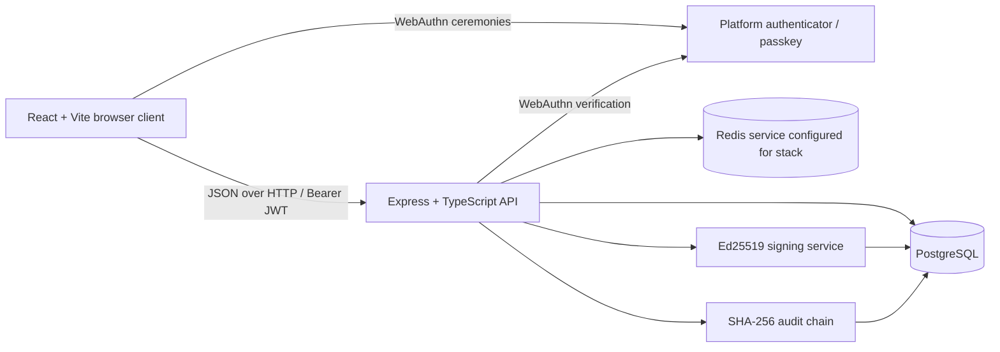
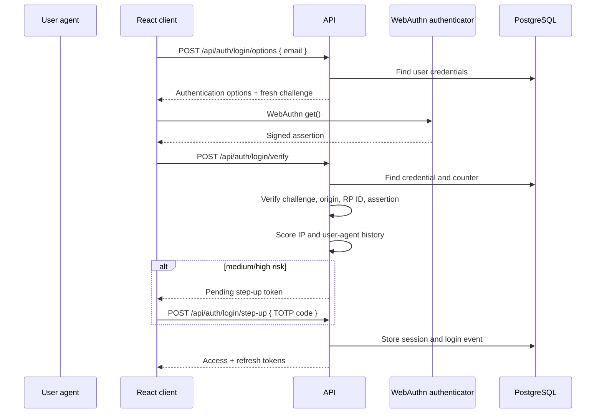
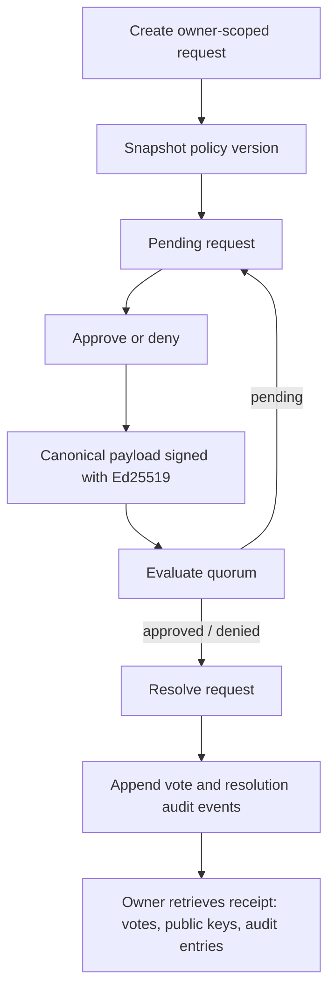
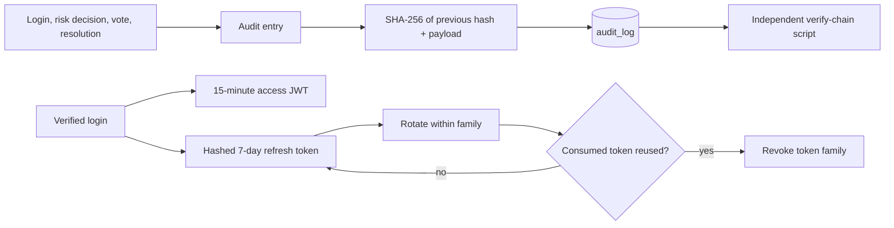

# TrustLine

> **Enterprise identity and approval security — built as a hands-on security engineering demonstration.**

[](https://www.typescriptlang.org/)
[](https://www.w3.org/TR/webauthn-3/)
[](https://www.postgresql.org/)
[](https://docs.docker.com/compose/)

TrustLine is a TypeScript application that combines passwordless sign-in, adaptive step-up authentication, approval decisions, and cryptographic evidence in one demonstrable workflow. It is designed for a hackathon and portfolio setting: the implementation favours inspectable security controls, clear user flows, and verifiable records over product claims that are not yet built.

| Enterprise Identity & Approval Security | Passwordless Authentication | Cryptographic Approval Ledger |
| --- | --- | --- |
| Policy-based requests, quorum evaluation, delegation, escalation, and break-glass routes | WebAuthn passkeys with platform authenticators | Ed25519-signed votes and SHA-256 hash-linked audit entries |
| Tamper-Evident Audit Trail | Dispute Resolution | Attack Simulation Environment |
| Independent chain verifier and user-scoped activity | Resolved-request receipts with signatures, public keys, and related audit entries | MFA-fatigue, refresh-token replay, phishing-clone, and number-matching demonstrations |

---

## Why TrustLine?

Enterprise identity failures often start before an attacker reaches an application: reused passwords can be replayed, phishing sites can harvest shared secrets, and a weak approval process can turn a single compromised account into an irreversible business action. Even when an approval is legitimate, organisations need evidence that explains who acted, what was signed, and whether the record has been altered.

TrustLine addresses these concerns in a compact, inspectable implementation:

- **Password reuse and phishing:** WebAuthn passkeys replace password entry with origin-bound public-key credentials.
- **Enterprise identity risk:** login history is evaluated using the request IP address and user-agent; medium and high outcomes require TOTP step-up.
- **Approval fraud and insider actions:** approval requests are owner-scoped, evaluated against a policy quorum, and votes are signed with Ed25519 keys.
- **Missing auditability:** security-relevant events are appended to a SHA-256 hash chain, while resolved requests expose their receipt evidence.
- **Session abuse:** refresh tokens are stored as hashes, rotated by family, and a detected replay revokes that family.

> **Scope note.** TrustLine is a demonstration application, not a complete enterprise IAM product. In particular, it does not currently implement a separate reviewer-assignment or role directory model, TOTP recovery codes, hardware key lifecycle management, or a distributed challenge store.

## Key Features

### Passwordless Authentication

Registration and sign-in use [`@simplewebauthn`](https://simplewebauthn.dev/) on top of the WebAuthn browser API. The server generates registration and authentication options, persists registered credential public keys and counters, and verifies assertions against the configured relying-party ID and allowed frontend origins. Platform authenticators such as Touch ID, Face ID, and device passkeys are used when the browser and device provide them.

### Multi-Factor Authentication

TrustLine can provision a TOTP secret, return an `otpauth://` URI for QR-code enrollment, and verify authenticator codes. A successful passkey login is scored before tokens are issued; medium- or high-risk outcomes return a short-lived pending token and require the TOTP step-up path. The login UI also contains a **number-matching push simulator** as an educational interaction, not a real push-notification service.

**Not implemented:** recovery codes, SMS/email factors, and a production push provider.

### Risk Engine

The current risk engine compares the request IP address and user-agent against the user’s five most recent login events:

| Signal | Current behaviour |
| --- | --- |
| No login history | `high` risk → TOTP step-up |
| New IP with familiar user-agent | `medium` risk → TOTP step-up |
| Familiar IP | `low` risk |
| New IP and new user-agent after history exists | `low` risk under the current heuristic |

Every decision is appended to the audit ledger. The dashboard presents a human-readable device label derived from the user-agent; TrustLine does **not** currently calculate or persist a separate device-fingerprint value.

### Secure Sessions

- Short-lived JWT access tokens are verified by protected API middleware.
- Refresh tokens are random values stored only as SHA-256 hashes in PostgreSQL.
- Every login starts a refresh-token family; rotation consumes the current token and issues a replacement in the same family.
- Reuse of a consumed refresh token revokes the whole family.
- The dashboard lists active refresh-token families with recent IP/user-agent context and can revoke a family belonging to the signed-in user.
- Browser tokens are retained in `sessionStorage` for the active browser session.

### Approval Workflow

An authenticated user can create policies and requests. Policies support `single_senior`, `n_of_m`, and `role_weighted` quorum shapes; the quorum evaluator is a deterministic, separately tested service. The application also includes delegation records, a periodic escalation check, and a break-glass route that marks an approval as requiring review.

For the current demo security model, requests, votes, resolved-request lists, and receipts are scoped to their requester. This prevents cross-user data exposure, but it also means this is **not** yet a multi-user reviewer-assignment workflow. The Dashboard’s demo policy uses `single_senior`, so one approve or deny vote resolves it.

### Cryptographic Signing

Every accepted vote is signed server-side with the voter’s Ed25519 private key over a canonical payload containing the request ID, decision, and timestamp. Public keys are retained with the vote evidence. Private keys are encrypted at rest with AES-256-GCM; the encryption key is derived from the configured signing-key encryption secret. The development configuration also supports a controlled, one-time re-encryption path for legacy local keys when that secret changes.

### Immutable Ledger

TrustLine appends audit entries into a SHA-256 hash chain. Each entry contains the preceding hash and a hash computed from that predecessor plus the event payload. The standalone `npm run verify-chain` script independently recomputes and validates the entire chain. The ledger is **tamper-evident**: a changed entry makes verification fail; it is not a blockchain or an externally replicated immutable store.

### Audit Trail

The application records login events, risk decisions, approval votes, and request-resolution events. Dashboard activity is filtered to the authenticated user’s relevant events. Audit writes are intentionally fail-open in this demo so a transient audit-write failure does not block authentication or an approval; production deployments may choose a stricter availability/integrity trade-off.

### Dispute Resolution

The Dispute Resolution screen lists the signed-in user’s resolved requests and loads a receipt containing:

- the request identifier;
- signed vote decisions and their Ed25519 public keys;
- related hash-chained audit entries; and
- displayed hashes, signatures, IDs, and timestamps with copy controls.

It demonstrates evidence review for a resolved request. It is not a full case-management or dispute-ticket lifecycle.

### Security Demonstrations

| Demonstration | What it shows |
| --- | --- |
| **Attack Demo** | Simulates repeated invalid step-up attempts to show rate limiting, and refresh-token replay to show family revocation. |
| **Phishing Clone Demo** | A clearly labelled simulated clone that invokes WebAuthn to explain that passkeys are origin-bound and do not reveal a reusable password. The page does not create an authenticated session. |
| **Push Simulator** | A local, number-matching second-device interaction used in the login demonstration. It models a confirmation UX; it does not send a notification. |

## Architecture

### System architecture



PostgreSQL is the active persistence layer for users, credentials, sessions, policies, requests, votes, signing keys, and audit entries. Redis is provisioned and required by configuration in the Docker stack; the current challenge and rate-limit stores are in-memory, so Redis is not yet used as their backing store.

### Authentication flow



### Approval and receipt flow



### Ledger and session flows



## Project Structure

```text
trustline/
├── backend/
│   ├── migrations/          PostgreSQL schema migrations
│   └── src/
│       ├── db/              PostgreSQL pool
│       ├── jobs/            Pending-request escalation job
│       ├── lib/             Configuration and structured logging
│       ├── middleware/      JWT authentication and error handling
│       ├── routes/          Auth, approval, ledger, and risk HTTP routes
│       ├── scripts/         Seed, smoke-test, load-test, and chain verification scripts
│       ├── services/        WebAuthn, sessions, TOTP, risk, quorum, keys, signing, audit
│       └── tests/           Vitest integration and unit tests
├── frontend/
│   └── src/
│       ├── components/      Reusable UI, including PushSimulator
│       ├── lib/             API client and token helpers
│       └── pages/           Login, registration, dashboard, dispute, and demo screens
├── docker-compose.yml       Local PostgreSQL, Redis, API, and frontend stack
└── start-demo.sh            Stack startup, migrations, and demo seed script
```

There are no top-level `ledger/` or `security/` directories: those concerns live in `backend/src/services/audit.service.ts`, `signing.service.ts`, `keys.service.ts`, `webauthn.service.ts`, and related middleware/routes.

## Technology Stack

| Area | Implementation |
| --- | --- |
| Frontend | React 19, TypeScript, Vite, React Router, Tailwind CSS |
| Backend | Node.js, Express 5, TypeScript, Pino |
| Authentication | WebAuthn / SimpleWebAuthn, TOTP via otplib, JWT |
| Security primitives | Ed25519, AES-256-GCM, SHA-256, WebAuthn credential counters |
| Database | PostgreSQL 16, node-postgres, node-pg-migrate |
| Infrastructure | Docker Compose, PostgreSQL, Redis service |
| Testing | Vitest, Supertest, frontend Oxlint, TypeScript type checking |

## Security Design

| Control | Current implementation |
| --- | --- |
| WebAuthn and passkeys | Registration/login options and server verification with credential counters, configured RP ID, and allowed origins. |
| Challenge verification | Registration and login challenges are held in separate in-memory maps and consumed only after successful verification. This is suitable for one local process, not horizontal scaling. |
| Origin / RP verification | SimpleWebAuthn verification uses the configured frontend-origin allowlist and `WEBAUTHN_RP_ID` (default `localhost`). |
| JWT and refresh tokens | 15-minute access JWTs; 7-day random refresh tokens stored as hashes and rotated by family. |
| Replay protection | WebAuthn counters are updated after successful assertions; reused refresh tokens revoke their family. |
| TOTP | QR-code provisioning and code verification; step-up attempts are rate-limited in memory. |
| Risk engine | Heuristic based on prior IP/user-agent login events and recorded in the audit chain. |
| Ed25519 and AES-GCM | Votes are signed using Ed25519 keys; private keys are encrypted using AES-256-GCM. |
| Audit trail | Serializable writes create a predecessor-linked SHA-256 chain; an independent verifier checks the chain. |
| Redis | Included in configuration and Docker infrastructure, but not yet used as a production session, challenge, or rate-limit store. |

## Approval Architecture

| Stage | Implementation |
| --- | --- |
| **Request** | A policy version is snapshotted when an authenticated owner creates a request. |
| **Vote** | Owner-scoped approve/deny vote endpoint prevents cross-user request access. |
| **Signature** | The server signs canonical vote data with the user’s Ed25519 key. |
| **Resolution** | The quorum service returns `pending`, `approved`, or `denied`; resolution time is recorded. |
| **Ledger** | Vote and resolution events are appended to the audit chain. |
| **Receipt** | The owner can retrieve vote signatures, public keys, and relevant audit entries. |

## API Overview

All protected endpoints expect `Authorization: Bearer <accessToken>`.

<details>
<summary><strong>Authentication and MFA</strong></summary>

| Method | Endpoint | Purpose |
| --- | --- | --- |
| POST | `/api/auth/register/options` | Generate passkey registration options. |
| POST | `/api/auth/register/verify` | Verify and store a passkey credential. |
| POST | `/api/auth/login/options` | Generate passkey authentication options. |
| POST | `/api/auth/login/verify` | Verify an assertion; issue session or step-up token. |
| POST | `/api/auth/login/step-up` | Verify TOTP for a pending risk step-up. |
| POST | `/api/auth/totp/setup` | Generate a TOTP secret and provisioning URI. |
| POST | `/api/auth/totp/verify` | Verify a TOTP code and enable TOTP. |
| POST | `/api/auth/refresh` | Rotate a refresh token. |
</details>

<details>
<summary><strong>Sessions and audit activity</strong></summary>

| Method | Endpoint | Purpose |
| --- | --- | --- |
| GET | `/api/auth/sessions` | List the current user’s active sessions. |
| DELETE | `/api/auth/sessions/:familyId` | Revoke one of the current user’s token families. |
| GET | `/api/auth/audit` | List activity entries relevant to the current user. |
</details>

<details>
<summary><strong>Approvals and ledger</strong></summary>

| Method | Endpoint | Purpose |
| --- | --- | --- |
| POST / GET | `/api/approval/policies` | Create or list approval policies. |
| GET | `/api/approval/policies/:id` | Retrieve a policy. |
| POST | `/api/approval/requests` | Create an owner-scoped approval request. |
| GET | `/api/approval/requests/pending` | List the current user’s pending requests. |
| POST | `/api/approval/requests/:id/votes` | Submit an approve/deny vote. |
| POST | `/api/approval/requests/:id/break-glass` | Force-approve an owned request and mark it for review. |
| POST | `/api/approval/delegations` | Create a delegation record. |
| GET | `/api/approval/requests` | List the current user’s resolved requests. |
| GET | `/api/ledger/receipt/:requestId` | Retrieve a receipt for an owned request. |
</details>

<details>
<summary><strong>Risk and disputes</strong></summary>

The risk decision runs inside the login flow; `/api/risk` is currently a `501 Not Implemented` placeholder. There is no separate dispute API: the Dispute Resolution page uses the resolved-request and receipt endpoints above.
</details>

## Development Setup

### Prerequisites

- Node.js 20+
- npm
- Docker Desktop / Docker Compose (recommended for PostgreSQL and Redis)
- A WebAuthn-capable browser and platform authenticator for passkey ceremonies

### Docker

```bash
git clone https://github.com/Kushh-Santhosh/TRUSTLINE.git trustline
cd trustline

# Docker Compose loads backend/.env for backend secrets and configuration.
cp backend/.env.example backend/.env
# Replace the placeholder JWT secrets before using anything beyond local demo work.

./start-demo.sh --build
```

The script starts the stack, applies migrations, and seeds demo records. URLs:

| Service | URL |
| --- | --- |
| Frontend | `http://localhost:5173` |
| API | `http://localhost:4000` |
| Health check | `http://localhost:4000/health` |

If port 5173 is unavailable, run the Vite frontend directly; the backend allowlist supports both `http://localhost:5173` and `http://localhost:5174` by default.

### Without Docker for the application processes

Start PostgreSQL and Redis yourself, then:

```bash
# Terminal 1 — database services can still be provided by Compose
docker compose up -d postgres redis

# Terminal 2 — API
cd backend
cp .env.example .env
npm install
npm run migrate:up
npm run seed
npm run dev

# Terminal 3 — frontend
cd frontend
npm install
npm run dev
```

The frontend defaults `VITE_API_URL` to `http://localhost:4000`.

### Environment variables

See [`backend/.env.example`](backend/.env.example) for the complete template.

| Variable | Required | Purpose |
| --- | --- | --- |
| `DATABASE_URL` | Yes | PostgreSQL connection string. |
| `REDIS_URL` | Yes | Redis connection string required by configuration. |
| `JWT_SECRET` / `JWT_REFRESH_SECRET` | Yes | JWT signing secrets. |
| `FRONTEND_ORIGIN` | No | Comma-separated allowed frontend origins. |
| `WEBAUTHN_RP_ID` | No | WebAuthn relying-party ID; `localhost` locally. |
| `SIGNING_KEY_ENCRYPTION_SECRET` | No | Dedicated private-key encryption secret; defaults to `JWT_SECRET`. |
| `SIGNING_KEY_PREVIOUS_ENCRYPTION_SECRETS` | No | Temporary comma-separated migration keys for legacy local signing records. |

### Quality checks

```bash
cd frontend && npm run lint && npm run build
cd ../backend && npm run typecheck && npm test

# Optional: independently validate the local audit chain
npm run verify-chain
```

## Demo Walkthrough

1. Open `/register`, enter an email, and create a passkey with the device authenticator.
2. Enrol the displayed TOTP secret in an authenticator app and verify the first code.
3. Open `/login` and authenticate with the registered passkey.
4. Complete number matching and/or TOTP if the demonstration flow requests it.
5. On the Dashboard, create a demo approval request.
6. Approve or deny it; the single-senior demo policy resolves after one vote.
7. Open **Dispute Resolution**, choose the resolved request, and inspect the receipt’s signatures, keys, and audit hashes.
8. Visit **Attack Demo** to observe MFA-fatigue rate limiting and refresh-token replay revocation.
9. Visit **Phishing Clone Demo** to review the origin-bound passkey explanation.

## Screenshots

Screenshots are intentionally not checked into this repository yet. Add captures to `docs/screenshots/` and replace the placeholders below for a submission or portfolio page.

| Screen | Placeholder / caption |
| --- | --- |
| Landing / Login | `` — passkey-first sign-in and adaptive step-up. |
| Registration | `` — passkey and TOTP enrollment. |
| Dashboard | `` — active sessions, owner-scoped approvals, and activity. |
| Approval | `` — request creation and approve/deny actions. |
| Ledger / Receipt | `` — signatures, public keys, and audit hashes. |
| Dispute | `` — evidence review for a resolved request. |
| Attack Demo | `` — rate-limit and replay simulations. |
| Phishing Demo | `` — clearly labelled phishing-resistance simulation. |

## Performance and Operational Characteristics

- The frontend is a statically built Vite SPA served by the Docker frontend image.
- The API is a single Express process with PostgreSQL-backed persistence.
- Audit appends use database transactions and lock the latest chain entry to maintain order.
- The escalation job runs every 30 seconds in the API process.
- Challenge storage and step-up rate limiting are in memory, so they reset on restart and are not suitable for multi-instance deployment without a shared store.

## Future Roadmap

- Move WebAuthn challenges and rate limits to Redis for multi-instance operation.
- Add explicit reviewer assignment, directory-backed roles, and role enforcement for multi-party approvals.
- Encrypt TOTP secrets using a managed key and add recovery-code support.
- Add stricter audit-write policies, external ledger anchoring, and operational monitoring.
- Introduce HttpOnly-cookie session handling and production secret management.
- Add signed receipt export and end-to-end browser test coverage.

## Contributors

Built for the Tally hackathon by the TrustLine project contributors. Contributions and issue reports are welcome; please keep security claims tied to reproducible implementation details.

## License

No license file is currently included. All rights are reserved unless the repository owner adds a license.
