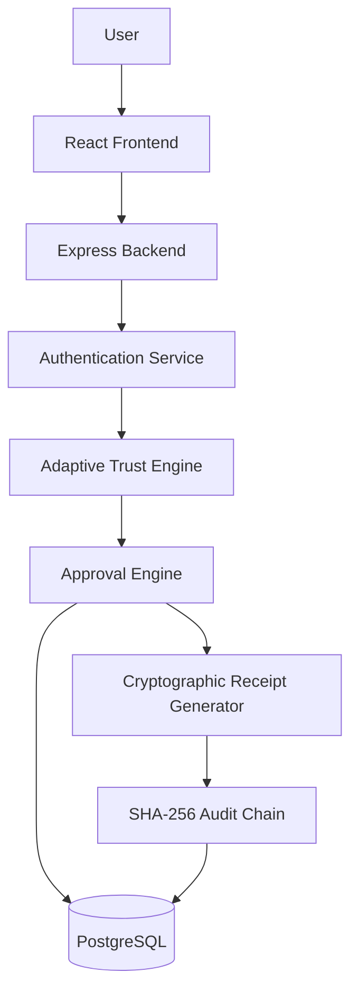
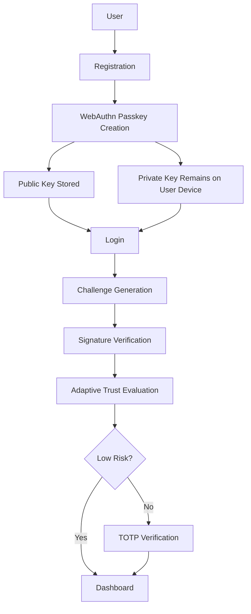
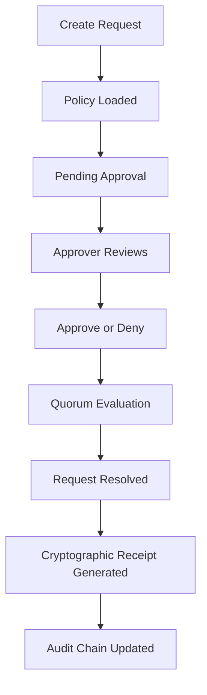
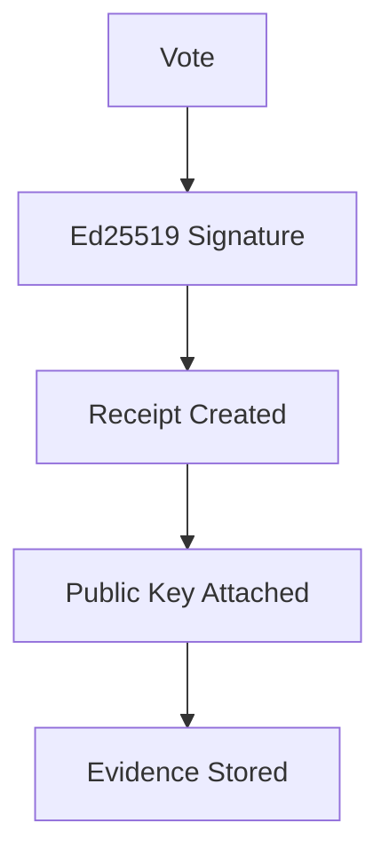
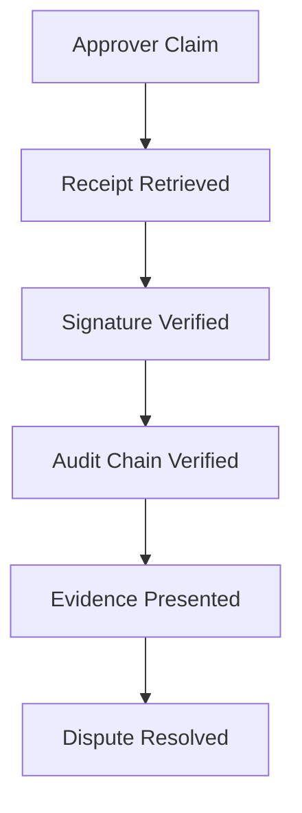

# TrustLine

TrustLine is a full-stack security demonstration for passwordless sign-in, adaptive MFA, approval workflows, and verifiable evidence. It addresses a simple enterprise problem: a successful password login alone does not prove that the context is familiar, that a sensitive action met the right approval policy, or that the decision can be checked later.

Passkeys reduce phishing exposure; adaptive authentication requests an extra factor when the context changes; approval policies turn a sensitive action into a reviewable decision; and cryptographic receipts plus a hash-linked audit trail make the resulting evidence inspectable. The design is intended to be understandable to both security and non-security judges.

## Project goals

- Passwordless WebAuthn/FIDO2 authentication rather than reusable passwords.
- Adaptive TOTP MFA when login context is elevated risk.
- Enterprise-oriented policy, request, vote, quorum, delegation, escalation, and break-glass workflow modelling.
- Ed25519-backed approval evidence and inspectable public keys.
- SHA-256 tamper-evident audit logs and a chain verifier.
- Evidence-led dispute resolution for resolved requests.

## Complete system architecture



| Component | What it does and why it exists | Communication |
| --- | --- | --- |
| User | Registers, signs in, completes MFA, and creates or reviews decisions. | Uses the browser application. |
| React Frontend | Provides registration, login, dashboard, approval, receipt, and educational demo screens. | Calls JSON API routes and invokes the browser WebAuthn API. |
| Express Backend | Hosts routes, authorization middleware, validation, and service orchestration. | Receives frontend requests and calls services and PostgreSQL. |
| Authentication Service | Runs WebAuthn, session, and TOTP operations. | Stores credential/session state and passes verified login context to risk evaluation. |
| Adaptive Trust Engine | Scores recent login context before a full session is issued. | Reads login history, logs a risk decision, and tells the auth route whether TOTP is needed. |
| Approval Engine | Creates policies and requests, records votes, and evaluates quorum. | Persists workflow state and triggers signatures and audit events. |
| PostgreSQL | Stores identities, credentials, sessions, policies, approvals, keys, and audit rows. | Backend services access it through `pg`. |
| Receipt Generator | Retrieves votes, signatures, public keys, and request-related audit entries. | Reads approval and evidence data from PostgreSQL. |
| Audit Chain | Links sequential security events with SHA-256. | Persists linked entries; the verifier recomputes their integrity. |

## Complete authentication flow



1. The user starts registration and the browser creates a WebAuthn credential.
2. The authenticator retains the private key; TrustLine stores the credential ID, public key, and counter.
3. At login, the backend creates a fresh challenge for the registered credential.
4. The authenticator signs that challenge. The server verifies the signature, challenge, origin, relying-party ID, and credential counter.
5. The Adaptive Trust Engine evaluates the verified login context. Low-risk logins enter the dashboard; medium or high risk requires TOTP first.

Private keys never leave the user’s authenticator, so TrustLine does not store a reusable password or a passkey private key. WebAuthn is phishing resistant because browsers and authenticators bind the credential ceremony to the configured legitimate origin. Signature verification proves possession of the registered credential for a new challenge, making passkeys safer than password entry against reuse, stuffing, and lookalike sites.

## Adaptive Trust Engine

TrustLine evaluates login context after passkey verification. The current transparent demo heuristic compares the incoming IP address and user agent with the user’s five latest login events:

- No login history is **high** risk.
- A new IP with a familiar user agent is **medium** risk.
- A familiar IP is **low** risk.
- Other established-history patterns are recorded as low risk by the current demo heuristic.

In a production risk engine, useful signals can include a new device, browser changes, IP changes, session history, device familiarity, and time anomalies. In TrustLine, medium and high risk return a short-lived pending token and require TOTP before the dashboard is shown. The step-up endpoint also demonstrates MFA-fatigue protection by blocking more than three attempts in a minute.

Adaptive authentication is better than always prompting for MFA because familiar, low-risk sign-ins stay quick while a changed context receives additional verification when it adds the most value.

## TOTP authentication

TrustLine uses RFC 6238-compatible TOTP enrollment and verification. The frontend renders the standard `otpauth://` provisioning URI as a QR code, and the user confirms a code from their authenticator.

Users may choose **any RFC 6238-compatible authenticator**, including Microsoft Authenticator, Google Authenticator, Authy, 1Password, Bitwarden, and Duo Mobile. Enterprise systems intentionally use these standard applications because they are trusted, secure, interoperable, audited, and widely adopted. A future version may include an optional TrustLine mobile authenticator while keeping this interoperable standard.

## Approval workflow



The user creates a request against a policy; the request remains pending while a decision is collected. The engine records an approve or deny vote, rejects duplicate votes, then evaluates the policy quorum as pending, approved, or denied. Resolved requests expose a receipt and their related audit events.

The demonstration uses a **Single Senior** policy as its simplest visible workflow. The quorum engine also models `n_of_m` and role-weighted policy shapes. Its data model can grow to multiple approvers across finance, HR, security, and management, including escalation and delegation. Full enterprise role governance remains future scope, not a current claim.

## Cryptographic receipt



Each approval vote uses a canonical payload and an Ed25519 signature. Ed25519 is a modern public-key signature algorithm with compact keys and signatures. TrustLine encrypts the stored signing private key with AES-256-GCM and attaches the public key, signature, vote, and related audit entries to the receipt. A reviewer can verify that a receipt payload has not changed by checking the signature against the attached public key.

This is strong integrity evidence for the demonstration. The current keys are server-managed, so TrustLine does not claim legal non-repudiation or user-held signing keys.

## Audit chain


Every audit row contains a previous hash and a current hash. The current hash is calculated from the previous hash plus the serialized payload. The first event uses a genesis value; each subsequent event links to its predecessor. Changing a payload, removing an entry, or altering a link is detectable when the chain is recomputed with `npm --prefix backend run verify-chain`.

Ordinary logs are independent rows. A hash chain adds a verifiable sequence relationship, making it better for integrity review. It is tamper-evident rather than externally immutable; database controls and external anchoring are appropriate future improvements.

## Dispute resolution



For a challenged decision, TrustLine retrieves the request receipt: votes, signatures, public keys, and request-related audit entries. A reviewer verifies the signature against the public key, recomputes the audit chain, and presents the resulting evidence. This is stronger than ordinary application logging because it combines payload-integrity checks with linked event history, while retaining the demo’s server-managed-key boundary.

## Folder structure

```text
frontend/                 React interface and browser WebAuthn flow
  src/pages/              Login, registration, dashboard, dispute, and demo pages
  src/components/         Reusable UI and security demonstration components
  src/lib/                API client and session helpers
backend/                  Express API and application services
  src/routes/             Authentication, approval, ledger, and risk endpoints
  src/services/           WebAuthn, TOTP, risk, quorum, signing, and audit logic
  src/db/                 PostgreSQL connection pool
  migrations/             Database schema migrations
  src/tests/              API integration and service tests
docs/                     Judge demo script, slide outline, and Q&A preparation
docker-compose.yml        Local PostgreSQL, Redis, backend, and frontend stack
start-demo.sh             Starts the stack, migrates, and seeds demo data
```

There is no separate `database/` directory: database configuration is in `backend/src/db/`, and the tracked schema source of truth is `backend/migrations/`.

## Technology stack

| Library / technology | Purpose | Why selected | Fit compared with common alternatives |
| --- | --- | --- | --- |
| React and React DOM | Frontend UI. | Clear component model for security flows. | A lighter scope than Angular and a familiar component workflow compared with Vue. |
| React Router | Browser routing. | Explicit URLs for login, dashboard, receipt, and demos. | Safer than hand-rolled navigation state. |
| TypeScript | Typed frontend and backend code. | Catches contract errors before runtime. | Safer API use than plain JavaScript. |
| Vite | Development server and production build. | Fast React and TypeScript workflow. | Modern alternative to Create React App. |
| Tailwind CSS | Responsive styling. | Consistent custom UI without a heavy component framework. | More flexible for this demo than Bootstrap defaults. |
| Express | Backend HTTP API. | Compact, explicit routes that judges can inspect. | Less framework ceremony than NestJS and less abstraction than a Fastify-first design. |
| PostgreSQL and `pg` | Relational storage and Node access. | Supports transactions, constraints, JSONB, and receipt joins. | Better for interconnected workflow data than a document-first store. |
| node-pg-migrate | Database migrations. | Repeatable schema setup. | Better than manual SQL-only setup. |
| SimpleWebAuthn | Browser and server WebAuthn ceremonies. | Maintained FIDO2/WebAuthn implementation. | Safer than handwritten protocol parsing. |
| Node.js `crypto` TOTP implementation | RFC 4226/RFC 6238 TOTP generation and verification. | Uses built-in HMAC, CSPRNG, Base32 validation, and timing-safe comparison while retaining standard authenticator interoperability. | Avoids an extra OTP dependency while keeping the implementation explicit and tested. |
| Node.js `crypto` | Ed25519, AES-GCM, SHA-256, randomness, verification. | Audited platform primitives. | Avoids unnecessary external crypto wrappers. |
| jsonwebtoken | Short-lived access and pending-step-up tokens. | Familiar signed API-token format. | Simpler for short-lived claims than an access-session lookup alone. |
| QRCode | TOTP enrollment QR code. | Makes provisioning usable with standard apps. | Better than manual secret entry alone. |
| dotenv | Local environment loading. | Keeps environment values out of source. | Sufficient for local development compared with a secrets platform. |
| cors | Origin policy middleware. | Restricts browser API access to configured origins. | Safer than manual headers per route. |
| Pino and pino-http | Structured logs. | Fast request-aware diagnostics. | More useful than `console.log` for API operations. |
| Docker Compose | Local deployment. | Consistent PostgreSQL, Redis, backend, and frontend stack. | Easier for judging than manual services; intentionally smaller than Kubernetes. |
| Vitest | Backend test runner. | Fast TypeScript-aware tests. | Simpler modern setup than a Jest-heavy configuration. |
| Supertest | HTTP integration tests. | Exercises Express routes directly. | More focused than browser automation for API assertions. |
| Oxlint | Frontend linting. | Fast static checks. | Efficient for this Vite project. |

## Demo flow

1. Register a user.
2. Create a passkey in the device authenticator.
3. Enroll TOTP by scanning the QR code in a standard authenticator app.
4. Log in with the passkey.
5. Observe adaptive trust evaluation and complete TOTP if required.
6. Open the dashboard.
7. Create an approval request.
8. Approve or deny the request.
9. Open dispute resolution.
10. Reveal the cryptographic receipt.
11. Verify the audit chain.

## Security features

| Feature | Role in TrustLine |
| --- | --- |
| WebAuthn passkeys | Passwordless public-key authentication with origin and relying-party checks. |
| Adaptive MFA | TOTP step-up for medium or high risk. |
| MFA rate limiting | Demonstrates short-window protection against MFA-fatigue attempts. |
| JWT sessions | Short-lived access tokens and refresh-token session management. |
| Ed25519 | Signs canonical approval-vote payloads. |
| AES-256-GCM | Encrypts stored signing private keys. |
| SHA-256 | Links audit events into a tamper-evident sequence. |
| Cryptographic receipts | Returns votes, signatures, public keys, and related audit entries. |
| Replay protections | One-time WebAuthn challenges, credential counters, and refresh-token rotation. |
| Phishing resistance | Passkeys are verified for the configured origin and relying-party ID. |

## Setup and verification

### Docker demo

Prerequisites: Node.js 20+, Docker Desktop with Docker Compose, and a WebAuthn-capable browser.

```bash
git clone https://github.com/DevOps-Tally/Fensta.git
cd Fensta
cp backend/.env.example backend/.env
# Replace JWT_SECRET and JWT_REFRESH_SECRET before any non-demo deployment.
./start-demo.sh --build
```

The launcher starts the stack, applies migrations, and seeds demo data.

- Frontend: `http://localhost:5173`
- API health: `http://localhost:4000/health`
- Dispute demo: `http://localhost:5173/demo/dispute`
- Attack simulation: `http://localhost:5173/demo/attack`
- Phishing-resistance demo: `http://localhost:5173/demo/phishing-clone`

### Local development

Start PostgreSQL, then run in separate terminals:

```bash
cd backend && npm install && npm run migrate:up && npm run dev
cd frontend && npm install && npm run dev
```

### Checks

```bash
npm run build
npm test
npm run lint
npm --prefix backend run verify-chain
```

## Future scope

- Push-based MFA and an optional TrustLine mobile authenticator.
- Enterprise SSO with SAML and OpenID Connect.
- Hardware security modules, cloud KMS, and managed key rotation.
- AI-assisted anomaly detection and continuous authentication.
- SIEM integration, compliance dashboards, and real-time security analytics.
- Organization management, RBAC, and separation-of-duties enforcement.
- Native mobile applications and hardware security-key support.
- Multi-region deployment, shared challenge/rate-limit storage, and externally anchored audit checkpoints.

## License

No license has been specified.
